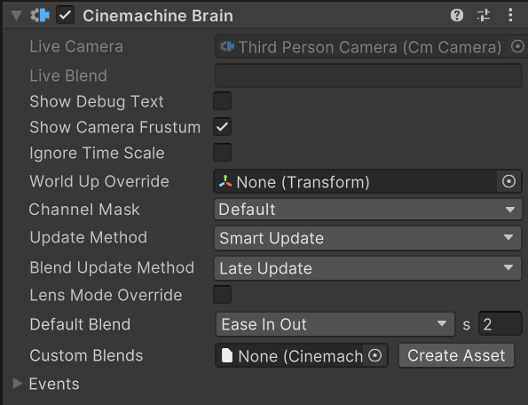

# Cinemachine 控制器组件（Cinemachine Brain component）

Cinemachine 控制器是 Unity 相机本身的一个组件。它会监控场景中所有激活的[**Cinemachine 相机（CinemachineCameras）**](CinemachineCamera.md)，选择下一个要控制 Unity 相机的 Cinemachine 相机，并控制从当前 Cinemachine 相机到下一个的[过渡效果（切换或混合）](concept-camera-control-transitions.md)。

带有 Cinemachine 控制器的对象在层级视图中会显示一个小的 Cinemachine 相机图标，你可以在 Cinemachine 偏好设置面板中关闭该图标。

要为 Unity 相机添加 Cinemachine 控制器组件，请执行以下**任一**操作：

* 使用菜单栏的「GameObject > Cinemachine」向场景中添加一个 Cinemachine 相机。如果当前没有 Cinemachine 控制器组件，Unity 会自动为 Unity 相机添加该组件。

* 手动向 Unity 相机[添加](https://docs.unity3d.com/Manual/UsingComponents.html) Cinemachine 控制器组件。

你也可以通过[时间线（Timeline）](concept-timeline.md)控制 Cinemachine 相机，此时时间线会覆盖 Cinemachine 控制器原本的决策。

Cinemachine 控制器包含以下关键属性：

* **混合设置（Blend Settings）**：定义从一个 Cinemachine 相机过渡到另一个的方式。例如，可添加一个条目设置从 vcam1 到 vcam2 的 4 秒混合效果，再添加另一个条目设置从 vcam2 回到 vcam1 的 1 秒混合效果。如果未定义两个相机之间的混合方式，Cinemachine 控制器会使用其默认混合效果。

* **通道筛选器（Channel Filter）**：Cinemachine 控制器仅使用那些输出到通道遮罩（Channel Mask）中包含的通道的 Cinemachine 相机。通过通道遮罩筛选通道，可设置[分屏环境](CinemachineMultipleCameras.md)。

* **事件分发（Event Dispatching）**：Cinemachine 控制器在切换镜头时会触发事件。当一个 Cinemachine 相机激活时会触发事件；从一个 Cinemachine 相机切换到另一个时也会触发事件（可使用后者重置时间相关的后期效果）。

## 属性（Properties）：

| **属性** || **功能** |
|:---|:---|:---|
| **显示调试文本（Show Debug Text）** || 勾选后，在视图中显示当前激活的 Cinemachine 相机和混合效果的文本摘要。 |
| **显示相机视锥体（Show Camera Frustum）** || 勾选后，在场景视图中显示相机的视锥体。 |
| **忽略时间缩放（Ignore Time Scale）** || 勾选后，即使游戏以慢动作运行，Cinemachine 相机也会实时响应用户输入和阻尼效果。 |
| **世界上方向覆盖（World Up Override）** || 指定游戏对象的 Y 轴定义 Cinemachine 相机的世界空间上方向向量。适用于俯视角游戏环境。设为 None 时使用世界空间 Y 轴。正确设置此属性可避免在极端上下角度下出现万向节锁问题。 |
| **通道遮罩（Channel Mask）** || Cinemachine 控制器会查找输出到所选任一通道的最高优先级 Cinemachine 相机，不输出到这些通道的 Cinemachine 相机会被忽略。通常应保持默认值，仅在需要多个 Cinemachine 控制器时（如实现分屏）修改。 |
| **更新方式（Update Method）** || 何时更新 Cinemachine 相机的位置和旋转。 |
| | **固定更新（Fixed Update）** | 在 FixedUpdate 中与物理模块同步更新 Cinemachine 相机。 |
| | **延迟更新（Late Update）** | 在 MonoBehaviour 的 LateUpdate 中更新。 |
| | **智能更新（Smart Update）** | 根据目标的更新方式更新每个 Cinemachine 相机，这是推荐设置。 |
| | **手动更新（Manual Update）** | Cinemachine 相机不会自动更新。必须在游戏循环的适当时间显式调用 `brain.ManualUpdate()`，且应在所有相机的 LookAt 或 Follow 目标移动之后调用。这是一个高级功能。 |
| **混合更新方式（Blend Update Method）** || 何时解析混合效果并更新主相机。 |
| | **延迟更新（Late Update）** | 在 MonoBehaviour 的 LateUpdate 中更新，这是推荐设置。 |
| | **固定更新（Fixed Update）** | 仅当更新方式设为 FixedUpdate 且混合时出现抖动时使用。 |
| **镜头模式覆盖（Lens Mode Override）** || 启用后，Cinemachine 相机可以覆盖相机的镜头模式（透视、正交或物理）。 |
| **默认模式（Default Mode）** || 当启用镜头模式覆盖且没有活跃的 Cinemachine 相机覆盖镜头模式时，此镜头模式将应用于相机。 |
| | **无（None）** | 如果启用镜头覆盖模式且默认模式设为 None，当 Cinemachine 相机不覆盖镜头模式时，不会有默认模式应用于相机。不推荐此设置，可能导致不可预测的结果，最好始终设置一个默认模式。 |
| | **正交（Orthographic）** | 将“投影（Projection）”属性设为“正交（Orthographic）”。 |
| | **透视（Perspective）** | 将“投影（Projection）”属性设为“透视（Perspective）”，并禁用“物理相机（Physical Camera）”功能及属性。 |
| | **物理（Physical）** | 将“投影（Projection）”属性设为“透视（Perspective）”，并启用“物理相机（Physical Camera）”功能及属性。 |
| **默认混合（Default Blend）** || 当未明确定义两个 Cinemachine 相机之间的混合方式时使用的默认混合效果。 |
| | **切换（Cut）** | 零时长混合（瞬间切换）。 |
| | **淡入淡出（Ease In Out）** | S 形曲线，过渡柔和平滑。 |
| | **淡入（Ease In）** | 从当前镜头线性退出，平滑淡入到目标镜头。 |
| | **淡出（Ease Out）** | 从当前镜头平滑淡出，线性过渡到目标镜头。 |
| | **强淡入（Hard In）** | 从当前镜头平滑淡出，快速切入目标镜头。 |
| | **强淡出（Hard Out）** | 从当前镜头快速退出，平滑淡入目标镜头。 |
| | **线性（Linear）** | 线性混合，过渡效果呈机械感。 |
| | **自定义（Custom）** | 自定义混合曲线，可绘制所需曲线。 |
| **自定义混合（Custom Blends）** || 包含场景中特定 Cinemachine 相机之间混合自定义设置的资源。 |
| **创建资源（Create Asset）** || 创建一个包含 C[inemachine 相机之间自定义混合列表](CinemachineBlending.md)的资源。 |
| **相机切换事件（Camera Cut Event）** || 当一个 Cinemachine 相机激活且无混合过渡时触发此事件。 |
| **相机激活事件（Camera Activated Event）** || 当一个 Cinemachine 相机激活时触发此事件。如果涉及混合过渡，则在混合的第一帧触发。 |