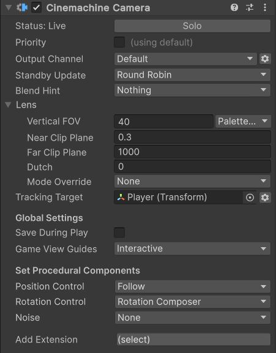

# Cinemachine 相机组件（Cinemachine Camera component）

Cinemachine 相机组件是一个需添加到空游戏对象（GameObject）上的组件，它在 Unity 场景中代表一个 Cinemachine 相机。

## 属性（Properties）

| **属性** || **功能** |
|:---|:---|:---|
| **单独激活（Solo）** || 切换该 Cinemachine 相机是否临时生效。使用此属性可在[游戏视图（Game view）](https://docs.unity3d.com/Manual/GameView.html)中立即获得视觉反馈，以便调整该 Cinemachine 相机。 |
| **优先级与通道（Priority And Channel）** || 此设置控制 Cinemachine 控制器（CinemachineBrain）如何使用该 Cinemachine 相机的输出。启用此选项可使用优先级（Priority）或自定义 Cinemachine 输出通道。 |
|| **通道（Channel）** | 用于控制该相机驱动哪个 Cinemachine 控制器。当场景中存在多个 Cinemachine 控制器时（例如实现分屏功能时），此属性必不可少。 |
|| **优先级（Priority）** | 在非时间线（Timeline）控制的情况下，用于控制多个激活的 Cinemachine 相机中哪个应生效。默认优先级为 0，可通过此属性指定自定义优先级值，数值越大表示优先级越高，也允许使用负值。Cinemachine 控制器会从所有已激活且优先级大于或等于当前生效相机优先级的 Cinemachine 相机中，选择下一个生效的相机。在时间线中使用该 Cinemachine 相机时，此属性无效。 |
| **待机更新（Standby Update）** || 控制 Cinemachine 相机未生效（非 Live 状态）时的更新频率，可通过此属性进行性能优化。 |
|  | **从不（Never）** | 仅当 Cinemachine 相机生效时才更新。若在镜头评估场景中使用该相机，请勿设置此值。 |
|  | **始终（Always）** | 即使 Cinemachine 相机未生效，也会每帧更新。 |
|  | **循环轮询（Round Robin）** | 偶尔更新 Cinemachine 相机，更新频率取决于处于待机状态的其他 Cinemachine 相机数量。 |
| **混合提示（Blend Hint）** || 为与该 Cinemachine 相机之间的位置混合提供提示，多个值可组合使用。 |
| | **球面位置（Spherical Position）** | 混合过程中，相机会围绕跟踪目标（Tracking Target）沿球面路径运动。 |
| | **柱面位置（Cylindrical Position）** | 混合过程中，相机会围绕跟踪目标沿柱面路径运动（垂直坐标采用线性插值）。 |
| | **目标不同时按屏幕空间对准（Screen Space Aim When Targets Differ）** | 混合过程中，跟踪目标的位置会在屏幕空间而非世界空间中进行插值。 |
| | **继承位置（Inherit Position）** | 当该 Cinemachine 相机生效时，若条件允许，会强制其初始位置与 Unity 相机的当前位置保持一致。 |
| | **忽略目标（Ignore Target）** | 混合旋转时不考虑跟踪目标，仅采用球面插值。 |
| | **混合退出时冻结（Freeze When Blending Out）** | 通常情况下，相机在混合过程中会保持生效状态以实现最平滑的过渡；若启用此提示，相机在混合退出过程中不会更新，而是会创建其状态快照，并基于该快照完成混合。 |

### 目标（Targets）

| **属性** || **功能** |
|:---|:---|:---|
| **跟踪目标（Tracking Target）** || Cinemachine 相机通过程序跟随的目标游戏对象。程序算法在更新 Unity 相机的位置和旋转时，会将此目标作为输入参数。 |
| **看向目标（Look At Target）** || 若启用，此属性指定一个单独的目标游戏对象，Unity 相机会对准该目标。[旋转控制属性](#set-procedural-components-and-add-extension)会使用此目标来更新 Unity 相机的旋转。 |

### 镜头（Lens）

> [!重要提示]
> 这些属性与[Unity 相机](https://docs.unity3d.com/Manual/class-Camera.html)的对应属性完全一致。

| **属性** || **功能** |
|:---|:---|:---|
| **视野（Field Of View）** || 相机垂直方向的视野角度（单位：度）。例如，若要模拟超 35 毫米（Super 35）传感器上 50 毫米镜头的视野，需输入 19.6 度的视野值。仅当带有 Cinemachine 控制器组件的 Unity 相机采用“透视（Perspective）”投影模式时，此属性才可用。也可通过[场景控制柄（Scene Handles）](handles.md)修改此属性。 |
| **预设（Presets）** || 常用镜头设置的下拉菜单。选择“编辑预设（Edit Presets）”可添加或编辑包含默认镜头列表的资源。 |
| **正交大小（Orthographic Size）** || 当使用正交相机时，此属性定义相机视野在世界坐标中的半高度。仅当带有 Cinemachine 控制器组件的 Unity 相机采用“正交（Orthographic）”投影模式时，此属性才可用。 |
| **近裁剪面（Near Clip Plane）** || 相机可绘制内容的最近点（相对于相机）。也可通过[场景控制柄](handles.md)修改此属性。 |
| **远裁剪面（Far Clip Plane）** || 相机可绘制内容的最远点（相对于相机）。也可通过[场景控制柄](handles.md)修改此属性。 |
| **倾斜角度（Dutch）** || 相机绕 Z 轴的倾斜角度（单位：度）。此属性为 Cinemachine 相机特有，Unity 相机无对应属性。 |
| **画幅适配（GateFit）** || 仅物理相机可用：当纵横比不同时，图像在传感器上的适配方式。 |
| **传感器尺寸（SensorSize）** || 仅物理相机可用：图像传感器的实际尺寸（单位：毫米）。 |
| **镜头偏移（LensShift）** || 仅物理相机可用：画幅相对于片门（film back）的位置。 |
| **对焦距离（FocusDistance）** || 仅物理相机可用：相机镜头最清晰对焦的距离。若在景深（Depth of Field）体积覆盖中，将对焦距离模式（FocusDistanceMode）设为“相机（Camera）”，则会使用此值；否则此值会被忽略。 |
| **感光度（Iso）** || 仅物理相机可用：传感器的感光度（ISO 值）。 |
| **快门速度（ShutterSpeed）** || 仅物理相机可用：曝光时间（单位：秒）。 |
| **光圈（Aperture）** || 仅物理相机可用：光圈数值（以 f 值表示）。 |
| **叶片数量（BladeCount）** || 仅物理相机可用：光圈叶片的数量。 |
| **曲率（Curvature）** || 仅物理相机可用：将光圈范围映射到叶片曲率的参数。 |
| **桶形裁剪（BarrelClipping）** || 仅物理相机可用：散景（bokeh）上“猫眼”效果（光学渐晕）的强度。 |
| **宽高比变形（Anamorphism）** || 仅物理相机可用：拉伸传感器以模拟变形镜头效果。正值会使相机垂直方向变形，负值会使相机水平方向变形。 |
| **模式覆盖（Mode Override）** || 当 Cinemachine 激活该 Cinemachine 相机时，允许选择不同的相机模式应用到[Unity 相机](https://docs.unity3d.com/Manual/class-Camera.html)组件上。 **重要提示**：要使此覆盖生效，必须在 Cinemachine 控制器的检视面板中启用“镜头模式覆盖（Lens Mode Override）”选项，并在其中指定默认镜头模式。 |
| | **无（None）** | 不改变 Unity 相机的“投影（Projection）”和“物理相机（Physical Camera）”属性。 |
| | **正交（Orthographic）** | 将“投影”属性设为“正交（Orthographic）”。 |
| | **透视（Perspective）** | 将“投影”属性设为“透视（Perspective）”，并禁用“物理相机”功能及相关属性。 |
| | **物理（Physical）** | 将“投影”属性设为“透视（Perspective）”，并启用“物理相机”功能及相关属性。 |

### 全局设置（Global Settings）

| **属性** || **功能** |
|:---|:---|:---|
| **运行时保存（Save During Play）** || 勾选后可[在运行模式下应用更改](CinemachineSavingDuringPlay.md)。使用此功能可微调 Cinemachine 相机，无需记忆需复制粘贴的属性。所有 Cinemachine 相机共享此设置。 |
| **游戏视图辅助线（Game View Guides）** || 切换游戏视图中构图辅助线的显示状态。当“跟踪目标（Tracking Target）”指定了游戏对象，且 Cinemachine 相机具有屏幕构图行为（如“位置合成器（Position Composer）”或“旋转合成器（Rotation Composer）”）时，这些辅助线可用。所有 Cinemachine 相机共享此设置。 |
|| **禁用（Disabled）** | 不显示游戏视图辅助线。 |
|| **被动显示（Passive）** | 仅在选中相关组件时，显示游戏视图辅助线。 |
|| **交互模式（Interactive）** | 选中相关组件时显示游戏视图辅助线，且可在游戏视图中用鼠标拖动辅助线以修改设置。 |

### 设置程序组件与添加扩展（Set Procedural Components and Add Extension）

| **属性** || **功能** |
|:---|:---|:---|
| **位置控制（Position Control）** || 通过在同一游戏对象上设置额外组件，为 Cinemachine 相机选择程序式位置行为。 |
|| [**跟随（Follow）**](CinemachineFollow.md) | 相对于“跟踪目标（Tracking Target）”保持固定位置关系运动。 |
|| [**轨道跟随（Orbital Follow）**](CinemachineOrbitalFollow.md) | 相对于“跟踪目标”保持可变位置关系运动，可选择接收玩家输入。 |
|| [**第三人称跟随（Third Person follow）**](CinemachineThirdPersonFollow.md) | 相机以“跟踪目标”为支点，围绕玩家进行水平和垂直旋转，并跟随跟踪目标的旋转。 |
|| [**位置合成器（Position Composer）**](CinemachinePositionComposer.md) | 相对于“跟踪目标”保持固定屏幕空间位置关系运动。 |
|| [**硬锁定到目标（Hard Lock to Target）**](CinemachineHardLockToTarget.md) | 与“跟踪目标”保持相同位置。 |
|| [**样条轨道（Spline Dolly）**](CinemachineSplineDolly.md) | 沿样条曲线（Spline）指定的预定义路径运动。 |
| **旋转控制（Rotation Control）** || 通过在同一游戏对象上设置额外组件，为 Cinemachine 相机选择程序式旋转行为。 |
|| [**旋转合成器（Rotation Composer）**](CinemachineRotationComposer.md) | 将“看向目标（Look At Target）”保持在相机画面内，支持构图控制和阻尼效果。 |
|| [**强制看向（Hard Look At）**](CinemachineHardLookAt.md) | 将“看向目标”保持在相机画面中心。 |
|| [**平移倾斜（Pan Tilt）**](CinemachinePanTilt.md) | 旋转 Cinemachine 相机，可选择基于用户输入。 |
|| [**跟随目标旋转（Rotate With Follow Target）**](CinemachineRotateWithFollowTarget.md) | 将相机旋转设置为与“跟踪目标”的旋转一致。 |
| **噪声（Noise）** || 用于设置 Cinemachine 相机程序式噪声行为的快捷方式。 |
| **添加扩展（Add Extension）** || 用于为 Cinemachine 相机添加程序式扩展行为的快捷方式。 |