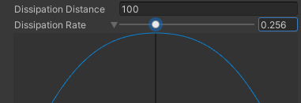
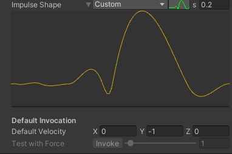

# Cinemachine 碰撞碰撞冲源（Cinemachine Collision Impulse Source）

对于基于碰撞的冲击效果，需将 **CinemachineCollision Impulse Source** 组件附加到带有碰撞体（Collider）或 2D 碰撞体（Collider2D）组件的游戏对象上。当有物体与该游戏对象发生碰撞或进入其触发区域时，**Cinemachine 碰撞冲击源**会生成冲击效果。

添加碰撞冲击源组件的步骤：

1. 选中要触发冲击效果的游戏对象，在其检视面板中点击 **Add Component** 按钮。
2. 依次选择 **Scripts > Cinemachine**，然后选中 **Cinemachine Collision Impulse Source**。

默认情况下，一个冲击源会影响范围内的所有[冲击监听器（Impulse Listener）](CinemachineImpulseListener.md)，但你可以通过[通道过滤（channel filtering）](CinemachineImpulseFiltering.md#ChannelFiltering)设置，让冲击源只影响特定的冲击监听器。

## 属性

Cinemachine 碰撞冲击源检视面板中的属性分为以下几个部分：

- [冲击通道（Impulse Channel）](#ImpulseChannel)
- [冲击类型（Impulse Type）](#ImpulseType)
- [冲击形状（Impulse Shape）](#ImpulseShape)
- [触发对象过滤（Trigger Object Filter）](#TriggerObject)
- [冲击生成方式（How to Generate The Impulse）](#GenerateImpulse)

### 冲击通道（Impulse Channel）

冲击监听器会根据通道过滤冲击信号，以控制它们对哪些冲击源做出反应。通道的作用类似相机图层（Camera Layers），但二者是不同的概念。以下属性用于控制碰撞冲击源广播冲击信号的通道。详情请参阅[过滤（Filtering）](CinemachineImpulseFiltering.md)文档。

| 属性 | 功能 |
| :--- | :--- |
| **冲击通道（Impulse Channel）** | 从下拉菜单中选择一个或多个通道。  点击 **Edit** 可修改现有通道或添加新通道。 |

### 冲击类型（Impulse Type）

你可以根据需求选择不同复杂程度的类型。更改冲击类型后，会显示相应的范围、衰减和传播速度控制选项。

| 属性 | 功能 |
| :--- | :--- |
| **冲击类型（Impulse Type）** | 可选择以下冲击类型：<ul> <li>**均匀（Uniform）**：冲击以无限速度传播，所有监听器无论在空间中处于什么位置，都会同时以相同方式接收到冲击。</li> <li>**衰减（Dissipating）**：冲击强度随与源的距离增加而减弱。距离较远的监听器感受到的信号比近处的弱。</li> <li>**传播（Propagating）**：除了具有衰减特性外，冲击信号从源向外以有限速度传播。距离较远的监听器会比近处的监听器晚感受到冲击。</li> <li>** legacy（旧版）**：此模式用于兼容使用早期版本冲击系统的项目，其定义冲击信号的方式更复杂。建议使用其他设置。</li> </ul> |
| **衰减距离（Dissipation Distance）** | 定义冲击衰减的距离范围。超过此距离后，将不会感受到冲击。 |
| **传播速度（Propagation Speed）** | 定义冲击信号从原点向外在空间中传播的速度（单位：米/秒）。默认值 343 为声速。 |
| **衰减率（Dissipation Rate）** | 定义在衰减距离内冲击衰减的速度。如下图所示，展开曲线可看到一个图表，展示了在衰减半径范围内的信号强度。X 轴中心为原点。拖动滑块可调整蓝色曲线的形状。   |

### 冲击形状（Impulse Shape）

定义指定信号形状的曲线，以及曲线的发射时长。

| 属性 | 功能 |
| :--- | :--- |
| **预设冲击形状（Predefined Impulse Shape）** | 可从以下预设形状中选择：**后坐力（Recoil）**、**撞击（Bump）**、**爆炸（Explosion）** 或 **震动（Rumble）**。  **s（秒）** 字段：设置冲击的持续时间。展开该属性可查看冲击的波形图：   |
| **自定义冲击形状（Custom Impulse Shape）** | 可绘制自己的自定义冲击形状（动画曲线）。从下拉菜单中选择 **Custom**，然后点击绿色图标弹出如下编辑器。   |
| **默认速度（Default Velocity）** | 指定冲击默认的空间方向。 |
| **用力量测试（Test with Force）** | 允许在检视面板中（运行时）以指定的力量倍数触发默认冲击，以查看效果。 |

### 触发对象过滤（Trigger Object Filter）

这些属性用于过滤碰撞或进入触发区域时会触发冲击的游戏对象。**图层遮罩（Layer Mask）** 中指定图层的游戏对象会触发冲击，除非它们被标记为 **忽略标签（Ignore Tag）**。详情请参阅[过滤（Filtering）](CinemachineImpulseFiltering.md)文档。

| 属性 | 功能 |
| :--- | :--- |
| **图层遮罩（Layer Mask）** | 这些图层中的刚体（Rigidbody）组件与冲击源发生碰撞或进入其触发区域时，会使源广播冲击信号。 |
| **忽略标签（Ignore Tag）** | 带有此标签的游戏对象即使处于 **图层遮罩** 中指定的图层，也不会生成冲击。 |

### 冲击生成方式（How To Generate The Impulse）

冲击由一定质量的物体以特定速度撞击某一位置而触发。Unity 会动态计算触发冲击的刚体（Rigidbody）或 2D 刚体（Rigidbody 2D）组件的质量和速度。**冲击生成方式**属性控制刚体的质量和速度如何影响信号的强度和方向。

| 属性 | 功能 |
| :--- | :--- |
| **使用冲击方向（Use Impact Direction）** | 启用此设置后，冲击信号会随冲击速度的方向旋转。例如，如果原始信号是垂直振动，但冲击方向是水平的，勾选此属性可使最终的冲击信号变为水平振动。  禁用此设置则无论冲击方向如何，都使用原始信号的方向。 |
| **随质量缩放冲击（Scale Impact With Mass）** | 启用此设置后，冲击信号的振幅会根据发生碰撞的游戏对象的质量增减。质量由包含 Cinemachine 冲击源的游戏对象及其碰撞对象的刚体（Rigidbody）或 2D 刚体（RigidBody2D）组件指定。  禁用此设置则使用固定质量 1。 |
| **随速度缩放冲击（Scale Impact With Speed）** | 启用此设置后，信号的振幅会根据冲击速度缩放。移动速度更快的游戏对象具有更大的动量，因此会产生更强的信号。  禁用此设置则忽略碰撞对象的速度。 |