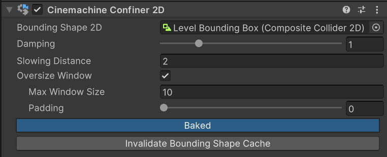

# Cinemachine 2D 限制器（Cinemachine Confiner 2D）

使用 Cinemachine 2D 限制器（一种[扩展组件](https://docs.unity3d.com/Packages/com.unity.cinemachine@2.6/manual/CinemachineVirtualCameraExtensions.html)）可以限制相机的位置，确保屏幕边缘始终处于由 2D 多边形定义的形状范围内。该组件适用于正交相机（orthographic camera）和透视相机（perspective camera），但要求相机的前向向量（forward vector）必须与边界形状的法线保持平行（即相机需正对着多边形，而非倾斜拍摄）。

在限制相机位置时，Cinemachine 2D 限制器会考虑相机在多边形平面上的视野大小（view size）及其宽高比（aspect ratio）。基于这些信息和输入的多边形，组件会计算出第二个（更小的）多边形，并将相机的变换（transform）约束在该多边形内。计算第二个多边形的过程会消耗较多资源，因此应仅在绝对必要时执行此操作。

需要重新计算缓存的第二个多边形的必要场景包括：
- 输入多边形的顶点（points）发生变化时；
- 输入多边形进行非均匀缩放（non-uniformly scaled）时。

在上述场景中，出于效率考虑，Cinemachine 不会自动重新生成内部多边形。开发者需要调用 `InvalidateBoundingShapeCache()` 方法来触发重新计算，具体可通过以下两种方式实现：
- 在脚本中调用 `InvalidateCache` 方法；
- 在组件检视面板中操作：点击 **“失效边界形状缓存”（Invalidate Bounding Shape Cache）** 按钮。

若输入多边形仅进行均匀缩放（uniformly scaled）、平移（translate）或旋转（rotate），则缓存仍保持有效。

当 Cinemachine 相机镜头的“正交大小”（Orthographic Size）或“视野”（Field of View）发生变化时，出于效率考虑，Cinemachine 不会自动调整限制器。若需调整限制器，需在脚本中调用 `InvalidateLensCache()` 方法。

## 超尺寸窗口（Oversize Windows）
如果限制多边形的某些区域过小，无法完全容纳相机窗口，那么在启用“超尺寸窗口”（Oversize Window）选项的情况下，Cinemachine 会为这些区域计算一个“多边形骨架”（polygon skeleton）。该骨架是一种无面积的形状，当相机被限制在该区域时，可作为相机的放置参考。

骨架计算是缓存计算中资源消耗最大的部分，因此需谨慎调整相关设置以优化性能：
- 为优化骨架计算，可将“最大窗口大小”（Max Window Size）属性设置为你预期的相机窗口最大尺寸。对于超过该尺寸的窗口，Cinemachine 不会花费时间计算其骨架。

## 效率优化（Efficiency）
使用多个“输入边界形状不同”的 Cinemachine 相机，并在它们之间进行混合（blend），比修改单个 2D 限制器（Confiner2D）的输入边界形状效率更高——因为计算限制器形状的初始成本较高。

## 注意事项（Remarks）
设置可用于 CinemachineConfiner2D 的[2D 复合碰撞体（Composite Collider 2D）](https://docs.unity3d.com/Manual/class-CompositeCollider2D.html)有多种方法，推荐使用以下结构：
1. 创建一个游戏对象（GameObject），并为其添加“2D 复合碰撞体”（Composite Collider 2D）组件；
2. 在“2D 复合碰撞体”组件中，将“是否为触发器”（Is Trigger）设为 `true`，将“几何类型”（Geometry Type）设为“多边形”（Polygons）；
3. 在添加“2D 复合碰撞体”组件时，Unity 会自动为该游戏对象添加“2D 刚体”（Rigidbody 2D）组件。将“2D 刚体”的“身体类型”（Body Type）设为“静态”（Static）；
4. 添加一个或多个子游戏对象（child GameObject），这些子对象将用于承载“2D 复合碰撞体”所需的 2D 碰撞体（Collider2D）；
5. 为这些子对象添加[2D 碰撞体（Collider2D）](https://docs.unity3d.com/Manual/Collider2D.html)，并将每个“2D 碰撞体”组件的“复合操作”（Composite Operation）设为 **“合并”（Merge）**。

当将包含“2D 碰撞体”的游戏对象分配给“2D 边界形状”（Bounding Shape 2D）时，Unity 会自动选择层级最顶层的“2D 碰撞体”。

# 属性（Properties）：

| **属性**               | **功能**                                                     |
|:----------------------|:------------------------------------------------------------|
| __2D 边界形状（Bounding Shape 2D）__ | 设置用于限制相机视口（viewport）的 2D 形状。                 |
| __阻尼（Damping）__    | 在拐角处应用阻尼以避免相机跳跃。数值越高，过渡越平缓。       |
| __减速距离（Slowing Distance）__ | 边界形状边缘处的减速区域大小。当相机向边缘移动且处于该距离范围内时，会逐渐减速，直至到达边缘。 |
| __最大窗口大小（Max Window Size）__ | 为优化计算和内存性能，将此属性设为预期的相机最大视野尺寸。2D 限制器不会为超过该尺寸的视锥体（frustum）计算多边形缓存。此处的尺寸指“限制器平面上视锥体的世界单位大小”（对于正交相机，即“正交大小”）。若设为 0，Cinemachine 会忽略该参数，为所有可能的窗口尺寸计算多边形缓存。 |
| __内边距（Padding）__  | 对于较大的窗口尺寸，限制器可能会生成面积为零的多边形。内边距可用于为这些多边形增加少量面积，避免其成为一系列不相连的点。 |