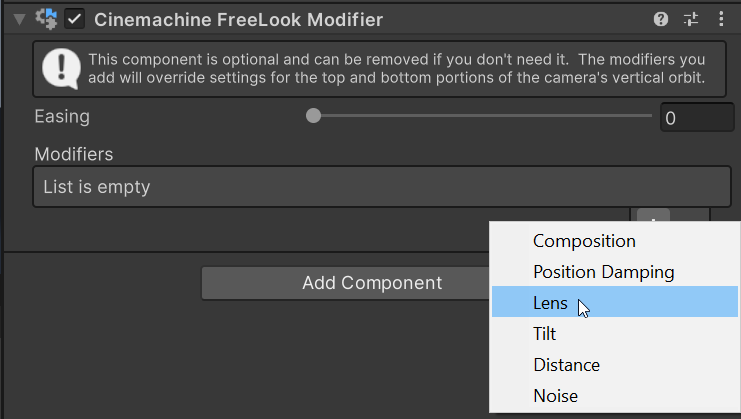
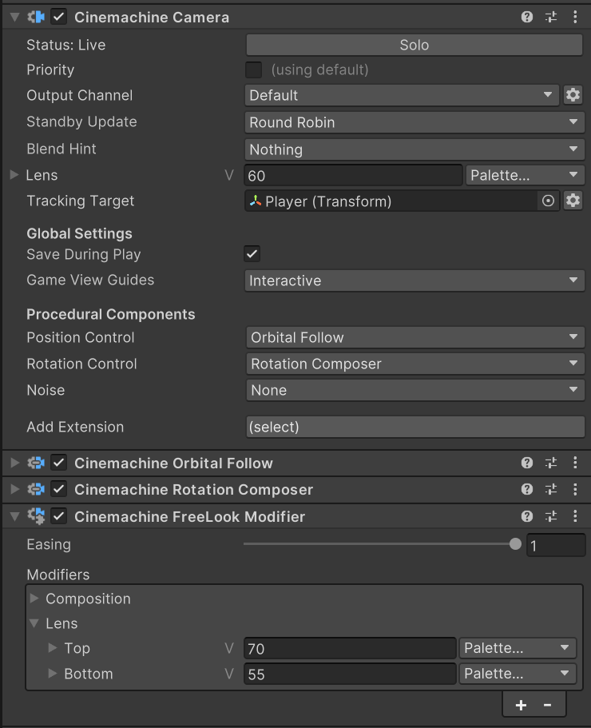

# Cinemachine 自由视角修改器（Cinemachine FreeLook Modifier）

此组件旨在添加到配置为[自由视角（FreeLook）](FreeLookCameras.md)的 Cinemachine 相机上。它并非必需组件（自由视角相机无需此组件也能正常工作），但可丰富相机的使用体验。

通过该组件，你可以根据相机在其定义轨道的顶部、中部或底部位置，改变一些设置（例如镜头参数、噪声、阻尼、构图或相机距离）。默认情况下，相机设置在整个轨道上保持不变。借助自由视角修改器，你可以改变这种固定状态。

该组件包含一个设置修改器列表，你可以添加任何可用的修改器。你也可以创建自定义修改器，它们会自动添加到选择列表中。

添加修改器后，面板会显示“顶部（Top）”和“底部（Bottom）”的设置项。目标行为中的设置决定了轨道中部的数值，因此此处不再重复显示。

例如，若 Cinemachine 相机的镜头视野（FOV）为 60，添加镜头修改器后，你可以将顶部视野设为 70（获得更宽的视角），底部视野设为 55（获得稍窄的镜头效果）。当用户在轨道中上下移动相机时，视野会从底部的 55 平滑过渡到中部的 60，再到顶部的 70。

> [!注意]
> 当自由视角修改器修改构图时，游戏视图中的辅助线会显示修改后构图的动态结果。这种情况下，你无法在屏幕上拖动游戏视图辅助线，必须通过检视面板设置顶部、中部和底部的数值。

> [!注意]
> [运行时保存（Save During Play）](CinemachineSavingDuringPlay.md)会跟踪修改器列表中现有项的属性变化，但不会跟踪运行模式下修改器的添加或移除操作。

## 属性（Properties）：

| 属性 | 功能 |
| :--- | :--- |
| **缓动（Easing）** | 向中心值过渡时应用的缓动程度。缓动值为 0 时，会以线性方式过渡经过中心值；缓动值为 1 时，经过中心值时的过渡效果会更平滑。 |
| **修改器（Modifiers）** | 一系列修改器，它们会根据自由视角的垂直轴数值修改相机设置。 |