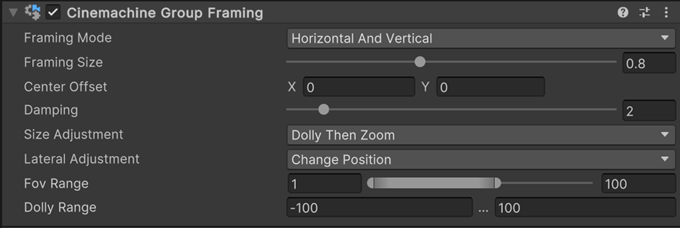

# Cinemachine 群组构图组件（Cinemachine Group Framing component）

该组件是 Cinemachine 相机的一款扩展组件，能够实现对“Cinemachine 目标群组（Cinemachine Target Group）”中一个或多个目标的构图功能。你可以通过它动态调整缩放比例，或让相机靠近/远离目标，从而使目标以期望的尺寸保持在画面范围内。

若要启用 Cinemachine 群组构图组件的功能，需完成以下操作：
* 将该组件添加到已包含[Cinemachine 相机（Cinemachine Camera）](CinemachineCamera.md)组件的游戏对象上。
* 创建一个独立的游戏对象，并为其添加[Cinemachine 目标群组（Cinemachine Target Group）](CinemachineTargetGroup.md)组件，然后将场景中需要一起构图的游戏对象设置为该群组的目标。
  * 确保 Cinemachine 目标群组至少包含一个成员，且其尺寸（size）不为零。
* 将 Cinemachine 相机的“跟踪目标（Tracking Target）”属性设置为上述创建的 Cinemachine 目标群组。

## 属性（Properties）

> [!注意]
> 部分属性是否可用，取决于你使用的 Unity 相机类型：[透视相机（perspective）或正交相机（orthographic）](https://docs.unity3d.com/Manual/CamerasOverview.html)。

| 属性 | | 功能 |
| :--- | :--- | :--- |
| **构图模式（Framing Mode）** | | 指定构图时需考虑的屏幕维度。 |
| | **水平（Horizontal）** | 仅考虑水平维度，忽略垂直构图。 |
| | **垂直（Vertical）** | 仅考虑垂直维度，忽略水平构图。 |
| | **水平与垂直（Horizontal And Vertical）** | 取水平和垂直维度中的较大值，以实现最佳适配效果。 |
| **构图尺寸（Framing Size）** | | 目标在屏幕空间中应占据的边界框大小。设为 1 表示填满整个屏幕，设为 0.5 表示填满半个屏幕，以此类推。 |
| **中心偏移（Center Offset）** | | 在相机画面中水平和垂直偏移群组的位置。 |
| **阻尼（Damping）** | | 构图调整的渐变程度。数值越大，响应速度越慢；数值越小，响应越灵敏。 |
| **尺寸调整方式（Size Adjustment）** | | 如何通过调整相机深度来实现期望的构图效果。可选择仅缩放、仅推移相机（靠近/远离），或两者结合。 仅在使用透视（perspective）类型的 Unity 相机时可用。 |
| | **仅缩放（Zoom Only）** | 不移动相机，仅调整视野（Field of View）。 |
| | **仅推移（Dolly Only）** | 移动相机，不改变视野。 |
| | **先推移后缩放（Dolly Then Zoom）** | 先在限定范围内尽可能移动相机，若仍未达到期望构图，则调整视野。 |
| **横向调整方式（Lateral Adjustment）** | | 如何通过水平和垂直方向调整相机来实现期望的构图效果。可选择改变位置重新构图，或旋转相机重新构图。 仅在使用透视类型的 Unity 相机时可用。 |
| | **改变位置（Change Position）** | 水平和垂直移动相机，直至达到期望构图。 |
| | **改变旋转（Change Rotation）** | 旋转相机，以实现期望构图。 |
| **视野范围（Fov Range）** | | 将相机的视野（Field of View）限制在指定范围内。 仅在“尺寸调整方式（Size Adjustment）”中包含“缩放（Zoom）”时可用。 |
| **推移范围（Dolly Range）** | | 限制相机为实现期望构图而移动的范围。负值表示向目标方向移动，正值表示向远离目标的方向移动。 仅在“尺寸调整方式”中包含“推移（Dolly）”时可用。 |
| **正交尺寸范围（Ortho Size Range）** | | 将相机的正交尺寸（Orthographic Size）限制在指定范围内。 仅在使用正交（orthographic）类型的 Unity 相机时可用。 |