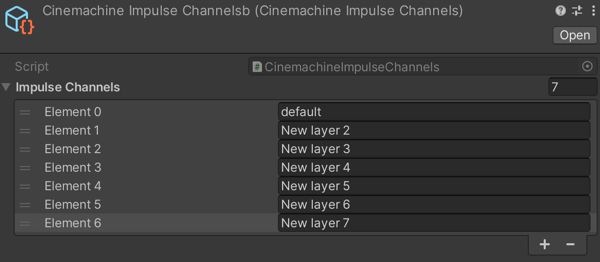

# 冲击信号过滤（Filtering impulses）

通过过滤功能，你可以精确调整冲击源（Impulse Source）生成冲击信号的方式和时机。Cinemachine 冲击系统支持两种过滤类型：

- 使用**通道过滤**，可设置冲击监听器（Impulse Listener）对特定冲击源做出反应，而忽略其他冲击源。详情见下文[通道过滤](#ChannelFiltering)。
- 结合**碰撞冲击源（Collision Impulse Source）** 使用**触发对象过滤**，可设置仅特定游戏对象能触发冲击信号。详情见下文[通过图层和标签过滤](#TriggerObjectFiltering)。

## 通道过滤（Filtering with channels）

默认情况下，每个冲击监听器会对范围内所有冲击源的信号做出反应。通过通道（Channels），你可以更精确地控制冲击监听器对哪些冲击源做出响应。设置通道过滤需完成以下三步：

1. 配置通道
2. 设置冲击源在一个或多个通道上广播信号
3. 设置冲击监听器监听一个或多个通道

当冲击监听器监听特定通道时，它只会对在这些通道上广播信号的冲击源做出反应。

### 添加通道（Adding channels）

**CinemachineImpulseChannels** 脚本用于在场景中创建通道。默认包含一个通道，你可以根据需要添加更多通道（最多 31 个）。

添加新通道的步骤：

1. 通过以下任一方式打开 **CinemachineImpulseChannels** 脚本的检视面板（**冲击通道 > 编辑**）：
   - 在 Cinemachine 冲击监听器的检视面板中，找到 **通道遮罩（Channel Mask）** 下拉菜单，点击旁边的 **编辑（Edit）** 按钮。
   - 在 Cinemachine 冲击源或碰撞冲击源的检视面板中，找到 **冲击通道（Impulse Channel）** 下拉菜单，点击旁边的 **编辑（Edit）** 按钮。

2. 展开 **冲击通道（Impulse Channels）** 属性组，将 **大小（Size）** 属性设为所需的通道数量。每个通道会显示为一个新条目。

3. 为重命名新通道。

   

   通道添加后，会立即显示在检视面板的通道下拉菜单中。

### 设置监听/广播通道（Setting listen / broadcast channels）

配置好通道后，需定义冲击监听器和冲击源如何使用这些通道：

- 检查每个冲击监听器，从 **通道遮罩（Channel Mask）** 下拉菜单中选择它需要监听的通道。
  
  

- 检查每个冲击源或碰撞冲击源，从 **冲击通道（Impulse Channel）** 下拉菜单中选择它需要广播信号的通道。
  
  

  你可以从下拉菜单中选择多个通道，也可以选择 **全部（Everything）** 以使用所有通道，或选择 **无（Nothing）** 以不使用任何通道。

## 通过图层和标签过滤（Filtering with layers and tags）

你可以使用 Unity 的[图层（Layers）](https://docs.unity3d.com/Manual/Layers.html)和[标签（Tags）](<https://docs.unity3d.com/Manual/Tags.html>)，指定哪些游戏对象在与碰撞冲击源发生碰撞或进入其触发区域时会触发冲击信号。这称为**触发对象过滤（Trigger Object Filtering）**。

Cinemachine 碰撞冲击源组件有两个**触发对象过滤（Trigger Object Filter）** 属性：

- **图层遮罩（Layer Mask）** 下拉菜单列出场景中的所有图层。选择一个或多个图层后，这些图层中的游戏对象与冲击源碰撞时会触发冲击信号。冲击源会忽略与其他图层中游戏对象的碰撞。

- **忽略标签（Ignore Tag）** 下拉菜单列出场景中的所有标签。选择某个标签后，带有该标签的游戏对象即使处于“图层遮罩”中指定的图层，与冲击源碰撞时也不会触发冲击信号。

例如，在一个场景中，有一只大型动物正在森林中行走，你可能希望当它撞到大树时相机产生抖动，而撞到小树苗时不抖动。

一种设置方式是：将这只动物设为碰撞冲击源，将所有大树放在单独的图层中，并在“图层遮罩”中选择该图层。

如果所有树木（无论大小）已处于同一图层，你可以为小树苗分配一个特殊标签，然后通过**忽略标签**属性将它们过滤掉。