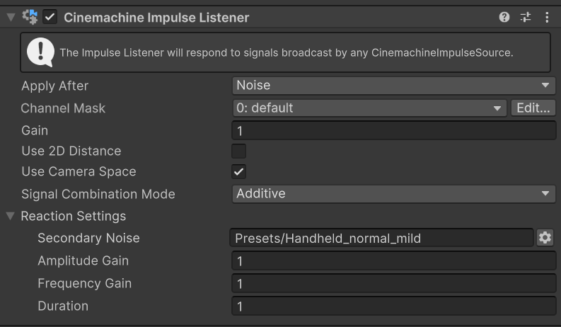

# Cinemachine 冲击监听器（Cinemachine Impulse Listener）

冲击信号和[冲击源（sources）](CinemachineImpulseSourceOverview.md)本身不会产生任何效果。**冲击监听器**是一款 Cinemachine 扩展组件，它能让 Cinemachine 相机“感知”到冲击振动信号并做出反应。

Cinemachine 内置的默认实现会将接收到的信号直接应用于监听器的变换位置，使其随信号产生抖动。此外，还可以指定次级响应——通常是沿所有位置和旋转轴的随机振动——为监听器的运动赋予独特特性。这就好比监听器被安装在弹簧上，然后被冲击信号“踢”了一下：除了“踢击”本身产生的推力，弹簧还会带来随机抖动。

当你为 Cinemachine 相机添加**冲击监听器**扩展后，相机会对冲击源发出的信号做出抖动响应。在最简单的情况下，冲击监听器会将信号直接应用于相机的变换（Transform），使其产生抖动。

下图中，角色的脚部是冲击源。当脚部与地面碰撞时（A），会生成冲击信号。相机作为冲击监听器，会对信号做出抖动反应（B），进而导致游戏视图（Game view）中的画面抖动（C）。

为 Cinemachine 相机添加冲击监听器的步骤：

1. 选中 Cinemachine 相机，在检视面板（Inspector）中展开 **CinemachineCamera** 脚本。
2. 进入 **Extensions > Add Extension**，选择 **CinemachineImpulseListener**。

在现实世界中，有些相机的安装不够稳固，因此更容易产生抖动。冲击监听器的**增益（Gain）** 属性通过放大或减弱冲击振动信号来模拟这种现象：数值越高，相机抖动越剧烈。

> [!提示]
> 你可以创建自定义冲击监听器，按任意方式解析振动信号。

> [!提示]
> 若要为非 Cinemachine 相机的游戏对象添加冲击监听功能，可使用 **CinemachineExternalImpulseListener** 行为组件。

默认情况下，冲击监听器会对范围内所有冲击源做出反应，但你可以通过[通道过滤（channel filtering）](CinemachineImpulseFiltering.md#ChannelFiltering)设置，让监听器只响应特定冲击源，忽略其他冲击源。

## 属性（Properties）：

| 属性 | 功能 |
| :--- | :--- |
| **应用顺序（Apply After）** | 指定冲击监听器在相机位置计算流程中的应用时机（例如在防碰撞或去遮挡处理之前/之后）。 |
| **通道遮罩（Channel Mask）** | 指定需要响应的冲击通道。详情请参阅[通道过滤（Filtering with channels）](CinemachineImpulseFiltering.md#ChannelFiltering)。 |
| **增益（Gain）** | 接收的冲击信号在反应时的放大倍数，是一个应用于输入信号的简单乘数，默认值为 1。 |
| **使用 2D 距离（Use 2D Distance）** | 启用后，计算相机与冲击源的距离时会忽略 Z 轴。此属性适用于 2D 游戏。 |
| **使用相机空间（Use Camera Space）** | 在相机局部空间而非世界空间中解析冲击信号。例如，若冲击信号的 Y 轴发生振动，监听器会沿自身局部 Y 轴上下移动。 |
| **信号组合模式（Signal Combination Mode）** | 控制冲击监听器如何组合空间中当前活跃的多个冲击信号，选项包括：<ul> <li>**叠加（Additive）**：将所有活跃信号叠加组合（类似声波），这是默认设置。</li> <li>**取最大（Use Largest）**：仅考虑振幅最大的信号，忽略其他信号。</li> </ul> |
| **响应设置（Reaction Settings）** | 允许你设置由冲击信号触发的次级噪声。选择噪声设置，并通过振幅和频率增益进行调整。“持续时间（Duration）”设置次级噪声的淡出时间（近似值），且会随冲击强度自动缩放。  监听器会将原始冲击信号与次级响应组合，并应用于其所附加的对象（可以是相机、虚拟相机或其他任何对象）。通过自定义监听器，可实现非标准的信号应用方式（例如将 Z 轴运动转换为视野（FOV）变化）。 |

### 术语补充说明
- **transform position**：变换位置，指游戏对象在 3D/2D 空间中的位置信息（由 Transform 组件控制）；
- **amplitude**：振幅，此处指冲击信号的强度大小，振幅越大，抖动越剧烈；
- **fade-out time**：淡出时间，指信号强度从峰值逐渐减弱至零的持续时间，用于实现平滑的抖动结束效果。