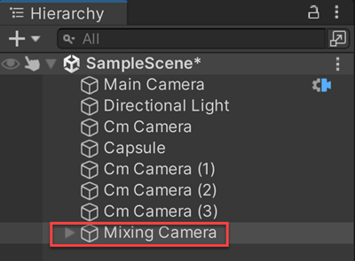
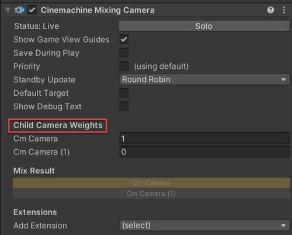

# Cinemachine 混合相机（Cinemachine Mixing Camera）

**Cinemachine 混合相机**组件通过对子级 Cinemachine 相机（CinemachineCamera）的加权平均值，计算 Unity 相机的位置及其他属性。

混合相机最多最多管理 8 个子级 Cinemachine 相机。在混合相机组件中，这些子级相机以固定插槽的形式存在，而非动态数组。混合相机采用这种实现方式是为了支持时间线（Timeline）中的权重动画——时间线无法对数组元素进行动画处理。

创建混合相机的步骤：

1. 在 Unity 菜单中，选择**GameObject > Cinemachine > Mixing Camera**。  
   新的混合相机会出现在[层级窗口（Hierarchy）](https://docs.unity3d.com/Manual/Hierarchy.html)中。默认情况下，Unity 还会添加两个 Cinemachine 相机作为混合相机的子级。
2. 调整子级 Cinemachine 相机的设置。
3. 最多可再添加 6 个子级相机。
4. 在层级窗口中选中混合相机，然后在[检视面板（Inspector）](https://docs.unity3d.com/Manual/UsingTheInspector.html)中调整“子相机权重（Child Camera Weights）”。

## 属性（Properties）：

| **属性** || **功能** |
|:---|:---|:---|
| **单独激活（Solo）** || 切换该 Cinemachine 相机是否暂时处于激活状态。使用此属性可在[游戏视图（Game view）](https://docs.unity3d.com/Manual/GameView.html)中获得即时视觉反馈，以便调整相机设置。 |
| **游戏视图辅助线（Game View Guides）** || 切换游戏视图中构图辅助线的可见性。当“跟踪目标（Tracking Target）”指定了某个游戏对象，且该 Cinemachine 相机具有屏幕构图行为（如位置构图器或旋转构图器）时，这些辅助线会生效。此设置对所有 Cinemachine 相机通用。 |
| **运行时保存（Save During Play）** || 勾选后，可[在运行模式下应用修改](CinemachineSavingDuringPlay.md)。使用此功能可微调 Cinemachine 相机，无需记住需要复制粘贴哪些属性。此设置对所有 Cinemachine 相机通用。 |
| **自定义输出（Custom Output）** || 此设置控制 Cinemachine 控制器（CinemachineBrain）如何使用该 Cinemachine 相机的输出。启用后可使用优先级（Priorities）或自定义 Cinemachine 输出通道。 |
|| **通道（Channel）** | 控制哪个 Cinemachine 控制器会被该相机驱动。当场景中有多个 Cinemachine 控制器时（例如实现分屏效果时），需要设置此属性。 |
|| **优先级（Priority）** | 当不受时间线控制时，用于控制多个激活的 Cinemachine 相机中哪个应处于激活状态。默认优先级为 0，可通过此属性指定自定义优先级值——值越高，优先级越高，也允许使用负值。Cinemachine 控制器会从所有已激活且优先级等于或高于当前激活相机的 Cinemachine 相机中，选择下一个激活的相机。此属性在时间线中使用 Cinemachine 相机时无效。 |
| **待机更新（Standby Update）** || 控制当 Cinemachine 相机未处于激活状态时的更新频率。可通过此属性优化性能。 |
|  | **从不（Never）** | 仅当 Cinemachine 相机处于激活状态时才更新。如果要在镜头评估场景中使用该相机，不要设置此值。 |
|  | **始终（Always）** | 即使 Cinemachine 相机未处于激活状态，也每帧更新。 |
|  | **轮询（Round Robin）** | 偶尔更新 Cinemachine 相机，更新频率取决于处于待机状态的其他 Cinemachine 相机数量。 |
| **默认目标（Default Target）** || 若启用，当子级 Cinemachine 相机未指定自己的“跟踪目标”时，将使用此目标作为备用。 |
| **显示调试文本（Show Debug Text）** || 若启用，当前状态信息将显示在游戏视图中。 |
| **子相机权重（Child Camera Weights）** || Cinemachine 相机的权重。每个子级 Cinemachine 相机都有一个对应的“权重（Weight）”属性。注意，将一个相机的权重设为 1 不会使其他相机的权重变为 0。单个相机的贡献值等于其权重除以所有子级相机的权重总和。 |
| **混合结果（Mix Result）** || 子级 Cinemachine 相机权重的图形化展示。每个子级相机进度条的亮色部分表示其对混合相机最终位置的贡献比例；当进度条完全为暗色时，该相机对混合相机的位置无贡献。 |