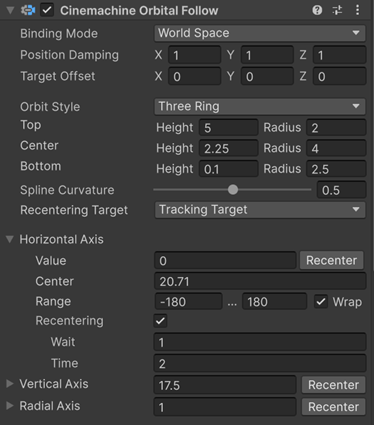

# 轨道跟随跟随（Orbital Follow）

这种 Cinemachine 相机的**位置控制（Position Control）** 行为会使 Unity 相机相对于 Cinemachine 相机的**跟踪目标（Tracking Target）** 处于可变位置关系。如果添加 [Cinemachine 输入轴控制器（Cinemachine Input Axis Controller）](CinemachineInputAxisController.md) 行为，相机位置可以由 [玩家输入（player input）](https://docs.unity3d.com/Manual/ConventionalGameInput.html) 驱动，这样玩家就能动态控制相机相对于目标的位置。

**轨道跟随**有两种运行模式：
- 球形（Sphere）：在此模式下，相机可位于围绕目标的球面上的任意一点。
- 三轨道（ThreeRig）：在此模式下，相机可位于通过将由 3 个圆形轨道定义的样条线围绕目标拉伸而形成的曲面上的任意位置。

相机在曲面上的确切位置由**轨道跟随**组件中的 3 个轴值决定：水平轴、垂直轴和半径轴。半径轴控制缩放比例，使相机能够朝向或远离目标移动。你可以通过自定义脚本、动画器（Animator）或其他你能想到的方式来控制这些值。

如果在 Cinemachine 相机上附加输入控制器，玩家就可以使用 Unity 的输入控件来控制相机在定义曲面上的位置。这使得玩家能够将相机移动到目标周围轨道曲面上的任意位置。

## 属性（Properties）

| 属性 | 功能 |
| :--- | :--- |
| **目标偏移（Target Offset）** | 在目标局部空间中，相对于目标对象中心的偏移量。当轨道的期望焦点不是被跟踪对象的中心时，可使用此属性微调轨道位置。 |
| **[绑定模式（Binding Mode）](#binding-modes)** | 用于解读相对于目标的偏移量的坐标空间。<ul> <li>**绑定目标时锁定（Lock To Target On Assign）**：在 Cinemachine 相机激活或指定目标的瞬间，使相机的朝向与跟踪目标的局部坐标系匹配。此后，该偏移量在世界空间中保持恒定，相机不会随目标旋转。</li> <li>**锁定到目标（世界上方向）（Lock To Target With World Up）**：使 Cinemachine 相机采用跟踪目标的局部坐标系，但将倾斜角（tilt）和侧滚角（roll）设为 0。此绑定模式仅考虑目标的偏航角（yaw），忽略其他旋转角度。</li> <li>**锁定到目标（无侧滚）（Lock To Target No Roll）**：使 Cinemachine 相机采用跟踪目标的局部坐标系，但将侧滚角（roll）设为 0。</li> <li>**锁定到目标（Lock To Target）**：使 Cinemachine 相机采用跟踪目标的局部坐标系。当目标旋转时，相机将随之移动，以保持偏移距离不变，并维持对目标的相同视角。</li> <li>**世界空间（World Space）**：偏移距离以跟踪目标的原点为基准，在世界空间中进行解读。当目标旋转时，相机位置不会发生变化。</li> <li>**惰性跟随（Lazy Follow）**：在相机局部空间中解读偏移距离和阻尼值。此模式模拟人类摄影师跟踪目标时的操作逻辑——相机尽量以最小的移动幅度保持与目标的距离，无需关注相机相对于目标的朝向。无论目标朝向如何，相机都会尝试与目标保持固定的距离和高度。</li> </ul> |
| **位置阻尼（Position Damping）** | 相机在 X、Y、Z 轴方向上维持偏移距离的响应速度。数值越小，相机响应越灵敏；数值越大，相机响应越缓慢。 |
| **角度阻尼模式（Angular Damping Mode）** | 包含“欧拉角（Euler）”和“四元数（Quaternion）”两种模式。  - 欧拉角模式：可分别为俯仰角（Pitch）、侧滚角（Roll）和偏航角（Yaw）设置阻尼值，但可能出现万向节锁问题。  - 四元数模式：仅需设置一个阻尼值，且可避免万向节锁问题。 |
| **旋转阻尼（Rotation Damping）** | 当处于“欧拉角角度阻尼模式”时，相机跟踪目标俯仰角、偏航角和侧滚角的响应速度。数值越小，相机响应越灵敏；数值越大，相机响应越缓慢。 |
| **四元数阻尼（Quaternion Damping）** | 当处于“四元数角度阻尼模式”时，相机跟踪目标旋转的响应速度。 |
| **轨道样式（Orbit Style）** | 控制所使用的轨道曲面类型。<ul> <li>**球形（Sphere）**：相机位于围绕目标的球面上的任意一点。</li> <li>**三圆环（ThreeRing）**：相机位于通过将由 3 个圆形轨道定义的样条线围绕目标拉伸而形成的曲面上的任意位置。</li> </ul> |
| **半径（Radius）** | 在球形模式下，此属性定义球面的半径。 |
| **顶部（Top）**、**中心（Center）**、**底部（Bottom）** | 在三圆环模式下，这些属性定义用于创建轨道曲面的 3 个轨道环的高度和半径。这些值相对于目标的原点。 |
| **样条线曲率（Spline Curvature）** | 在三圆环模式下，此属性定义连接 3 个轨道的线条的紧绷程度。该线条决定了曲面的最终形状。 |
| **重新居中目标（Recentering Target）** | 定义水平重新居中的参考坐标系。轴中心会动态更新为所选对象的后方。<ul> <li>**轴中心（Axis Center）**：静态参考坐标系。轴中心值不会动态更新。</li> <li>**父对象（Parent Object）**：轴中心会动态调整到父对象前方的后方。</li> <li>**跟踪目标（Tracking Target）**：轴中心会动态调整到跟踪目标前方的后方。</li> <li>**看向目标（LookAt Target）**：轴中心会动态调整到看向目标前方的后方。</li> </ul> |
| **水平轴（Horizontal Axis）** | 相机在曲面上的水平位置（绕 Y 轴旋转）。值以度为单位，“范围（Range）”定义允许的数值限制。如果勾选“环绕（Wrap）”，当数值超出其范围边缘时会环绕。你可以在此处定义一个“中心（Center）”位置，如果轴驱动程序中启用了重新居中逻辑，就可以使用该位置。 |
| **垂直轴（Vertical Axis）** | 相机在曲面上的垂直位置（绕 X 轴旋转）。在球形模式下，值以度为单位，但在三圆环模式下，值为任意单位。“范围”定义允许的数值限制。如果勾选“环绕”，当数值超出其范围边缘时会环绕。你可以在此处定义一个“中心”位置，如果轴驱动程序中启用了重新居中逻辑，就可以使用该位置。 |
| **径向轴（Radial Axis）** | 通过缩放轨道来控制相机与目标的距离。值是轨道高度和半径的标量乘数。“范围”定义允许的数值限制。如果勾选“环绕”，当数值超出其范围边缘时会环绕。你可以在此处定义一个“中心”位置，如果轴驱动程序中启用了重新居中逻辑，就可以使用该位置。 |
| **重新居中（Recentering）** | 如果为某个轴启用，重新居中功能会逐渐将该轴的值恢复到其“中心”位置。<ul> <li>**等待（Wait）**：如果为某个轴启用了重新居中，在最后一次用户输入后，会等待该秒数才开始重新居中过程。</li> <li>**时间（Time）**：重新居中开始后，完成重新居中所需的时间。</li> </ul> |

## 绑定模式（Binding Modes）

[!include]