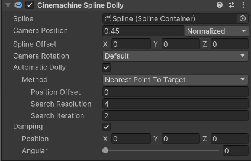

# 样条线移动器（Spline Dolly）

此 Cinemachine 相机（CinemachineCamera）的**位置控制（Position Control）** 行为会将相机限制在预设的样条线（Spline）上移动。可通过**相机位置（Camera Position）** 属性指定相机在样条线上的位置。

启用**自动移动（Automatic Dolly）** 功能后，相机将以自动方式移动到样条线上的某个位置：既可以是固定速度移动，也可以移动到样条线上与**跟踪目标（Tracking Target）** 最近的点，还可以是你自定义的其他移动方式。

**提示**：当使用“到目标的最近点（Nearest Point to Target）”自动移动模式时，请谨慎选择样条线的形状。对于围绕某一点形成弧形的样条线，此模式可能会出现问题。举一个极端例子：若样条线是完美的圆形，且**跟踪目标**位于圆心处，此时样条线上所有点到目标的距离都相等，导致“最近点”变得不稳定。这种情况下，即使**跟踪目标**只移动很小的距离，也可能导致相机在样条线上产生大幅度移动。

## 属性（Properties）：

| **属性** || **功能** |
|:---|:---|:---|
| **样条线（Spline）** || 相机将沿此样条线移动。 |
| **相机位置（Camera Position）** || 相机在样条线上的放置位置。可直接为此属性制作动画，也可启用“自动移动（Automatic Dolly）”功能。数值单位由“位置单位（Position Units）”属性指定。 |
| **位置单位（Position Units）** || “路径位置（Path Position）”属性所使用的计量单位。 |
| | **节点（Knot）** | 数值代表节点索引。值为 0 表示样条线的第一个节点，值为 1 表示第二个节点，以此类推；非整数值表示节点之间的点。 |
| | **距离（Distance）** | 以常规距离单位（如米、单位长度等）表示的沿样条线距离，值为 0 表示样条线的起点。 |
| | **归一化（Normalized）** | 值为 0 表示样条线的起点，值为 1 表示样条线的终点（即无论样条线实际长度如何，均将其整体长度视为 1 个单位）。 |
| **样条线偏移（Spline Offset）** || 相机相对于样条线上某点的偏移位置。其中，X 轴垂直于样条线，Y 轴为上方向，Z 轴平行于样条线。可通过此属性让相机偏离样条线本身。 |
| **相机旋转（Camera Rotation）** || 相机旋转角度和上方向（Up）的设置方式。此属性会影响屏幕构图，因为相机的瞄准（Aim）行为始终会尝试遵循上方向。 |
| | **默认（Default）** | 不修改相机的旋转角度或上方向，而是使用 Cinemachine 控制器（Cinemachine Brain）中的“世界上方向覆盖（World Up Override）”属性。 |
| | **路径（Path）** | 使用样条线在当前点的上方向向量和切线方向（来确定相机旋转和上方向）。 |
| | **路径（无侧滚）（Path No Roll）** | 使用样条线在当前点的上方向向量和切线方向，但将侧滚角（roll）设为 0。 |
| | **跟随目标（Follow Target）** | 使用跟踪目标（Tracking target）变换组件中的上方向向量和旋转角度。 |
| | **跟随目标（无侧滚）（Follow Target No Roll）** | 使用跟踪目标变换组件中的上方向向量和旋转角度，但将侧滚角设为 0。 |
| **自动移动（Automatic Dolly）** || 控制是否启用沿样条线的自动移动功能。 |
| **方式（Method）** || 控制自动移动的实现方式。可通过编写自定义的 SplineAutoDolly.ISplineAutoDolly 类，为此功能扩展自定义逻辑。 |
| | **无（None）** | 不启用自动移动。需通过设置“路径位置（PathPosition）”属性，手动控制 Cinemachine 相机在样条线上的位置。 |
| | **固定速度（Fixed Speed）** | 相机以设定的固定速度沿路径移动。 |
| | **到目标的最近点（Nearest Point To Target）** | 将相机定位到样条线上与跟踪目标位置最近的点。此模式要求 Cinemachine 相机必须设置跟踪目标；也可指定与最近点的偏移量，用于微调相机位置。 |
| **阻尼（Damping）** || 控制相机向样条线上目标点移动的“急切程度”。数值越小，相机移动速度越快；数值越大，相机移动越“沉重”、越缓慢。 |
| | **位置（Position）** | 相机在样条线局部空间的 X、Y、Z 三个方向上，维持偏移量的“急切程度”：  - X 轴：垂直于样条线的轴，可用于平滑路径中的不平整（可能导致相机偏离样条线）；  - Y 轴：样条线局部空间的上方向轴，可用于平滑路径中的不平整（可能导致相机偏离样条线）；  - Z 轴：平行于样条线的轴，此方向的阻尼不会导致相机偏离样条线。 |
| | **角度阻尼（Angular Damping）** | 相机维持目标旋转角度的“急切程度”。仅当“相机旋转（Camera Rotation）”未设为“默认（Default）”时，此属性才生效。 |