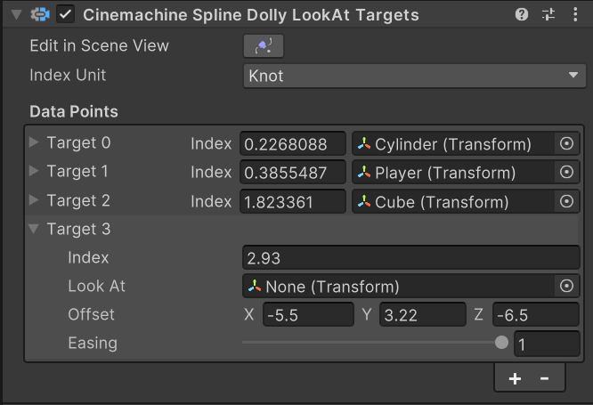
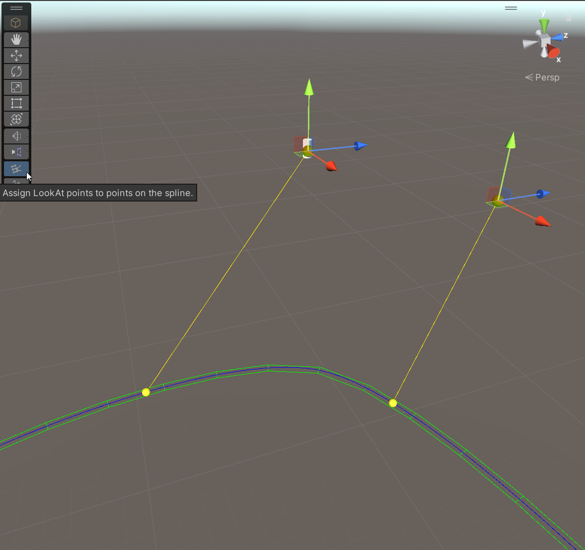

# Cinemachine 样条线移动器看向目标（Cinemachine Spline Dolly LookAt Targets）

此 Cinemachine 相机（CinemachineCamera）的**旋转控制（Rotation Control）** 行为，允许你为样条线（Spline）上的特定点分配“看向目标（LookAt Target）”——这样，当相机移动到样条线上的对应位置时，就会朝向预设的目标方向。

该行为适用于创建“定制化移动镜头（curated dolly shots）”，即在镜头沿路径移动的过程中，可预设多个瞄准目标。使用此行为后，无需再为相机制作与样条线位置动画同步的旋转动画：“看向点（LookAt Point）”会锚定在样条线的特定位置上，且由于这些点明确了相机的瞄准目标，相应的旋转角度会被动态计算出来。因此，即便样条线后续被修改，旋转动画也更稳定，不易出现异常。

若要使用此行为，可在 Cinemachine 相机检视面板的“旋转控制（Rotation Control）”区域中选择它，或直接手动添加到 Cinemachine 相机上。请注意，Cinemachine 相机的“位置控制（Position Control）”区域必须已添加 **Cinemachine 样条线移动器（CinemachineSplineDolly）** 行为。之后，在该行为的数组中添加“数据点（Data Points）”即可。

### 场景视图工具（Scene View Tool）
当在检视面板中选中“样条线上看向数据（LookAtDataOnSpline）”行为时，会提供一个场景视图工具，用于在样条线上定位“看向目标”。通过该工具，你可以添加、删除“看向目标”，也可以调整其位置。

### 属性（Properties）

| 属性 | 字段 | 说明 |
| --- | --- | --- |
| **索引单位（Index Unit）** |  | 定义如何解读每个数据点的“索引（Index）”字段。推荐选择“节点（Knot）”模式，因为即便样条线上的点发生变化，此模式下的索引仍能保持稳定。 |
| **数据点（Data Points）** |  | 样条线上“看向目标”的列表。当相机移动到样条线上的这些位置附近时，会朝向对应的目标。 |
| | **索引（Index）** | 样条线上相机应朝向对应目标的位置。该数值的解读方式由“索引单位（Index Unit）”设置决定。 |
| | **看向目标（Look At）** | 相机要瞄准的目标对象。可设为“无（None）”，此时“偏移量（Offset）”字段将指定世界空间中的一个点。 |
| | **偏移量（Offset）** | 相对于“看向目标”原点的偏移量（以局部坐标为单位）。若“看向目标（Look At）”设为“无（None）”，则此偏移量表示世界空间中的一个点。 |
| | **缓动（Easing）** | 控制相机朝向该目标时的缓动过渡效果。值为 0 时，相机在不同“看向点”之间会以线性插值方式过渡；值为 1 时，相机旋转速度会减慢，并会短暂暂停以瞄准该目标。 |