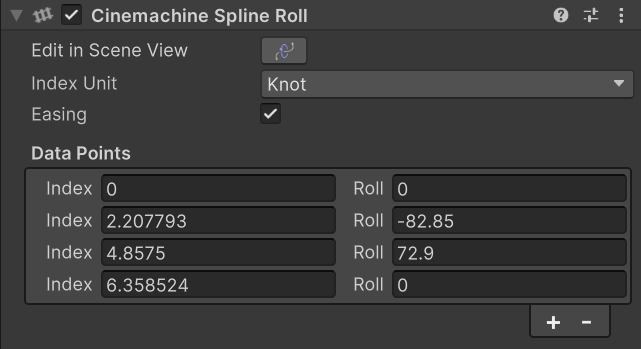

# Cinemachine 样条线侧滚（Cinemachine Spline Roll）

此行为可为样条线（Spline）添加侧滚（Roll）效果。侧滚指围绕样条线切线方向的旋转。通过添加数据点，可在样条线的特定位置设置侧滚角度，侧滚角度会在这些数据点之间进行插值计算。此外，该行为还会在场景视图（Scene view）中绘制“铁轨式（railroad-track）”辅助线（Gizmo），帮助可视化侧滚效果。

若将此行为添加到样条线本身，那么所有沿该路径移动的 [Cinemachine 相机（Cinemachine Camera）](CinemachineCamera.md) 或 [Cinemachine 样条轨道小车（Cinemachine Spline Cart）](CinemachineSplineCart.md) 都会遵循该侧滚设置；若仅将此行为添加到 Cinemachine 相机上，则只有该相机能呈现此侧滚效果。

### 属性（Properties）

| 属性 | 字段 | 说明 |
| --- | --- | --- |
| **索引单位（Index Unit）** |  | 定义如何解读每个数据点的“索引（Index）”字段。推荐选择“节点（Knot）”模式，因为即便样条线上的点发生变化，此模式下的索引仍能保持稳定。 |
| **缓动（Easing）** |  | 启用后，侧滚数值在数据点数值之间会有缓动过渡效果；禁用时，侧滚数值将以线性插值方式过渡。 |
| **数据点（Data Points）** |  | 样条线上侧滚点的列表。在样条线的这些位置，会应用预设的侧滚角度。 |
| | **索引（Index）** | 样条线上应应用指定侧滚角度的位置。该数值的解读方式由“索引单位（Index Unit）”设置决定。 |
| | **侧滚（Roll）** | 样条线的侧滚角度值，单位为度（°），旋转轴为该位置处样条线的切线方向。 |