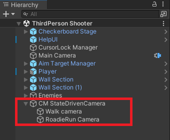
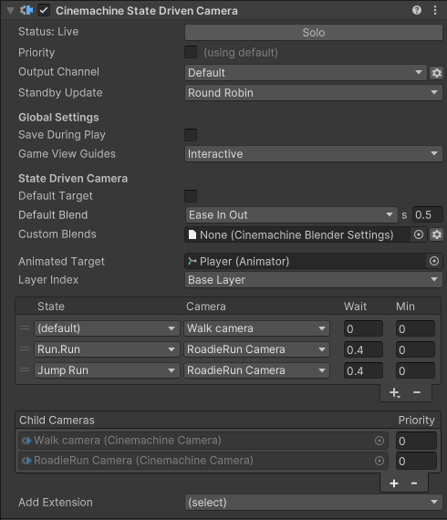

# Cinemachine 状态驱动相机（Cinemachine State-Driven Camera）

**Cinemachine 状态驱动相机**组件允许你将 Cinemachine 相机（CinemachineCamera）与动画状态相关联。当某个状态激活时，与其关联的 Cinemachine 相机也会随之激活。这使你能够为特定的动画状态定义专属的相机设置和行为。例如，你可以为“行走（Walk）”状态设置一个相机，为“奔跑（Run）”状态设置另一个相机。当动画目标切换状态时，状态驱动相机会在这些相机之间进行混合过渡。

状态驱动相机的动画目标是一个带有[动画器（Animator）](https://docs.unity3d.com/Manual/class-Animator.html)组件的游戏对象，该组件由[动画控制器（Animator Controller）](https://docs.unity3d.com/Manual/class-AnimatorController.html)控制。

为每个子级 Cinemachine 相机指定常规的**跟踪目标（Tracking Targets）**。如果某个子级 Cinemachine 相机没有设置**跟踪目标**，状态驱动相机可以提供自己的目标作为备用。

状态驱动相机包含一个列表，用于将子级 Cinemachine 相机分配给不同的动画状态。你可以定义子级相机之间的默认混合和自定义混合。无需为所有状态都定义相机：如果为默认状态定义了相机，那么该相机将用于所有未指定专属相机的状态。

如果为某个状态定义了多个相机，状态驱动相机会选择优先级最高的那个；如果同一状态的多个相机优先级相同，则选择列表中出现位置最早的那个。

在检视面板中，状态驱动相机会列出其所有子级 Cinemachine 相机。你可以通过该列表添加或删除子级 Cinemachine 相机，并分配优先级。

创建状态驱动相机的步骤：

1. 配置动画目标游戏对象，使其由[动画控制器控制](https://docs.unity3d.com/Manual/AnimatorControllers.html)。

2. 在 Unity 菜单中，选择**游戏对象（GameObject）> Cinemachine > 状态驱动相机（State-Driven Camera）**。 层级窗口中会出现一个新的状态驱动相机，且该相机下会自动创建一个子级 Cinemachine 相机。

3. 在[检视面板（Inspector）](https://docs.unity3d.com/Manual/UsingTheInspector.html)中，将步骤 1 中创建的动画目标分配给“动画目标（Animated Target）”属性。

4. 如有需要，可通过点击“Cinemachine 相机子级（CinemachineCamera Children）”中的“+”按钮，或在[层级窗口（Hierarchy）](https://docs.unity3d.com/Manual/Hierarchy.html)中拖放已有的 Cinemachine 相机，来添加更多子级 Cinemachine 相机。

5. 使用**状态（State）** 选项，将子级 Cinemachine 相机分配给对应的动画状态。

## 属性（Properties）：

| **属性** || **功能** |
|:---|:---|:---|
| **单独激活（Solo）** || 切换该 Cinemachine 相机是否暂时处于激活状态。使用此属性可在[游戏视图（Game view）](https://docs.unity3d.com/Manual/GameView.html)中获得即时视觉反馈，以便调整相机设置。 |
| **游戏视图辅助线（Game View Guides）** || 切换游戏视图中构图辅助线的可见性。当“跟踪目标（Tracking Target）”指定了某个游戏对象，且该 Cinemachine 相机具有屏幕构图行为（如位置构图器或旋转构图器）时，这些辅助线会生效。此设置对所有 Cinemachine 相机通用。 |
| **运行时保存（Save During Play）** || 勾选后，可[在运行模式下应用修改](CinemachineSavingDuringPlay.md)。使用此功能可微调 Cinemachine 相机，无需记住需要复制粘贴哪些属性。此设置对所有 Cinemachine 相机通用。 |
| **自定义输出（Custom Output）** || 此设置控制 Cinemachine 控制器（CinemachineBrain）如何使用该 Cinemachine 相机的输出。启用后可使用优先级（Priorities）或自定义 Cinemachine 输出通道。 |
|| **通道（Channel）** | 控制哪个 Cinemachine 控制器会被该相机驱动。当场景中有多个 Cinemachine 控制器时（例如实现分屏效果时），需要设置此属性。 |
|| **优先级（Priority）** | 当不受时间线控制时，用于控制多个激活的 Cinemachine 相机中哪个应处于激活状态。默认优先级为 0，可通过此属性指定自定义优先级值——值越高，优先级越高，也允许使用负值。Cinemachine 控制器会从所有已激活且优先级等于或高于当前激活相机的 Cinemachine 相机中，选择下一个激活的相机。此属性在时间线中使用 Cinemachine 相机时无效。 |
| **待机更新（Standby Update）** || 控制当 Cinemachine 相机未处于激活状态时的更新频率。可通过此属性优化性能。 |
|  | **从不（Never）** | 仅当 Cinemachine 相机处于激活状态时才更新。如果要在镜头评估场景中使用该相机，不要设置此值。 |
|  | **始终（Always）** | 即使 Cinemachine 相机未处于激活状态，也每帧更新。 |
|  | **轮询（Round Robin）** | 偶尔更新 Cinemachine 相机，更新频率取决于处于待机状态的其他 Cinemachine 相机数量。 |
| **默认目标（Default Target）** || 若启用，当子级 Cinemachine 相机未指定自己的“跟踪目标”时，将使用此目标作为备用。 |
| **显示调试文本（Show Debug Text）** || 若启用，当前状态信息将显示在游戏视图中。 |
| **动画目标（Animated Target）** || 包含动画控制器（Animator Controller）的游戏对象。状态驱动相机会对该游戏对象的动画状态变化做出响应。 |
| **图层（Layer）** || 要观察的“动画目标（Animated Target）”中的动画图层。 |
| **默认混合（Default Blend）** || 如果未为两个 Cinemachine 相机之间明确定义混合方式，则使用此默认混合。 |
| **自定义混合（Custom Blends）** || 包含特定子级相机之间混合的自定义设置的资源。 |
| **状态（State）** || Cinemachine 相机将要映射到的动画状态。 |
| **相机（Camera）** || 为此状态激活的 Cinemachine 相机。 |
| **等待（Wait）** || 进入该状态后，延迟激活 Cinemachine 相机的时间（以秒为单位）。例如，动画目标从激活的“行走（Walk）”状态切换到“慢跑（Jog）”状态，再切换到“奔跑（Run）”状态。如果“慢跑（Jog）”状态的“等待（Wait）”时间设为 4 秒，那么即使“慢跑（Jog）”状态已激活，“行走（Walk）”对应的 Cinemachine 相机仍会保持激活 4 秒。如果在“等待（Wait）”时间结束前，动画目标就切换到了其他状态，且“慢跑（Jog）”状态的持续时间短于“等待（Wait）”时间，那么“慢跑（Jog）”对应的 Cinemachine 相机将不会激活，直接被跳过。 |
| **最小时长（Min）** || 一旦激活，Cinemachine 相机必须保持激活状态的最短时间（以秒为单位）。例如，动画目标从“慢跑（Jog）”状态进入“奔跑（Run）”状态，且在切换到“奔跑（Run）”状态前，已在“慢跑（Jog）”状态停留了 5 秒。如果“慢跑（Jog）”状态的“最小时长（Min）”设为 12 秒，那么即使动画目标已处于“奔跑（Run）”状态，“慢跑（Jog）”对应的 Cinemachine 相机仍会保持激活状态 7 秒（补足 12 秒）。 |
| **Cinemachine 相机子级（CinemachineCamera Children）** || 状态驱动相机的所有子级 Cinemachine 相机列表。 |