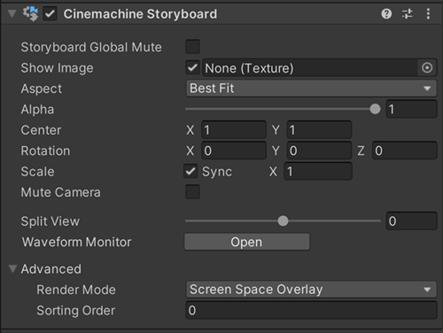

# 故事板（Storyboard）

使用 Cinemachine 故事板[扩展组件](concept-procedural-motion.md#extensions)，可让美术师、制作人及导演参与到游戏开发流程中。Cinemachine 故事板会在 Unity 相机的输出画面上，以屏幕空间的形式叠加一张静态图像。

故事板功能为团队简化了动态分镜（animatics）的制作流程：先通过静态图像对地形、布局、运动轨迹、光照、时间节奏等内容进行预可视化；然后开发人员根据故事板图像所呈现的设计意图，逐步添加资源、游戏对象（GameObject）及场景设置，最终实现完整场景。

通过故事板组件的属性，可隐藏或显示叠加图像，以便将其与 Unity 相机的实际渲染画面进行对比。

故事板可在全局层面关闭（完全禁用）：如需切换全局关闭状态，可进入 Cinemachine 故事板组件，启用“故事板全局静音（Storyboard Global Mute）”选项。

## 属性（Properties）：

| **属性** || **功能** |
|:---|:---|:---|
| **故事板全局静音（Storyboard Global Mute）** || 启用后，所有故事板将在全局范围内被关闭。 |
| **显示图像（Show Image）** || 切换故事板图像的可见性。 |
| **图像（Image）** || 要叠加在 Cinemachine 相机输出画面上的图像。 |
| **宽高比适配（Aspect）** || 处理图像宽高比与屏幕宽高比不匹配的方式。 |
| | **最佳适配（Best Fit）** | 在不裁剪图像的前提下，将图像缩放到屏幕可容纳的最大尺寸，同时保持图像的水平和垂直比例。 |
| | **裁剪图像以适配（Crop Image To Fit）** | 将图像缩放至填满整个屏幕，必要时对图像进行裁剪，保持图像的水平和垂直比例。 |
| | **拉伸以适配（Stretch To Fit）** | 将图像缩放至填满整个屏幕，必要时调整图像的水平或垂直宽度（可能导致图像变形）。 |
| **透明度（Alpha）** || 图像的不透明度。值为 0 时图像完全透明，值为 1 时图像完全不透明。 |
| **中心（Center）** || 图像在屏幕空间中的位置。值为 0 时表示屏幕中心。 |
| **旋转（Rotation）** || 图像在屏幕空间中的旋转角度。 |
| **缩放（Scale）** || 图像在屏幕空间中的缩放比例。 |
| **同步缩放（Sync Scale）** || 勾选后，图像的 X 轴和 Y 轴缩放比例将保持同步（即等比例缩放）。 |
| **静音相机（Mute Camera）** || 勾选后，将阻止 Cinemachine 相机更新 Unity 相机的位置、旋转或缩放。使用此功能可防止时间线（Timeline）将相机[混合过渡](CinemachineBlending.md)到场景中不符合预期的位置。 |
| **分屏视图（Split View）** || 沿水平方向逐步显示或隐藏图像（实现“擦除”式切换效果）。 |
| **波形监视器（Waveform Monitor）** || 打开波形监视器窗口。此功能对性能消耗极大，请谨慎使用。 |