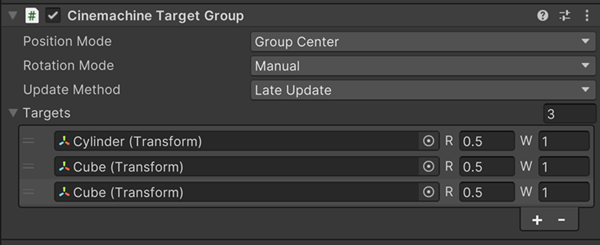

# Cinemachine 目标群组（Cinemachine Target Group）

使用 Cinemachine 目标群组，可将多个游戏对象（GameObject）视为单个跟踪目标（Tracking Target）。对于需要知晓目标尺寸的程序化行为（例如 [群组构图（Group Framing）](CinemachineGroupFraming.md) 扩展），也可将目标群组用作其目标。

## 创建目标群组的步骤：
1. 向一个空游戏对象（empty GameObject）添加 **CinemachineTargetGroup** 组件。

## 创建带有目标群组的 Cinemachine 相机的步骤：
1. 在 Unity 菜单中，选择 **游戏对象（GameObject）> Cinemachine > 目标群组相机（Target Group Camera）**。 Unity 会向场景中添加一个新的 Cinemachine 相机和一个目标群组，且该 Cinemachine 相机的“跟随（Follow）”和“看向（Look At）”目标会指向这个新目标群组。

## 将现有 Cinemachine 相机的目标转换为目标群组的步骤：
1. 在 Cinemachine 相机的检视面板（Inspector）中，点击“跟踪目标（Tracking Target）”字段右侧的弹出菜单，选择 **转换为目标群组（Convert to TargetGroup）**。

## 为目标群组添加成员的步骤：
1. 在[层级窗口（Hierarchy）](https://docs.unity3d.com/Manual/Hierarchy.html)中，选中新创建的目标群组对象。
2. 在[检视面板（Inspector）](https://docs.unity3d.com/Manual/UsingTheInspector.html)中，点击“+”号，向群组中添加新成员。
3. 在新添加的成员项中，分配一个游戏对象（可从层级窗口中拖放），并编辑“权重（Weight）”和“半径（Radius）”属性。
4. 若要向目标群组添加更多游戏对象，重复步骤 2-3 即可。

## 属性（Properties）：

| **属性** || **功能** |
|:---|:---|:---|
| **位置模式（Position Mode）** || 计算目标群组位置的方式。 |
| | **群组中心（Group Center）** | 使用包含目标群组所有成员的轴对齐包围盒（axis-aligned bounding box）的中心作为群组位置。 |
| | **群组平均值（Group Average）** | 使用目标群组所有成员位置的加权平均值作为群组位置。 |
| **旋转模式（Rotation Mode）** || 计算目标群组旋转角度的方式。 |
| | **手动（Manual）** | 使用目标群组自身变换组件（transform）的“旋转（Rotation）”属性中指定的值作为群组旋转角度。 |
| | **群组平均值（Group Average）** | 使用目标群组所有成员朝向（orientation）的加权平均值作为群组旋转角度。 |
| **更新方式（Update Method）** || 更新目标群组变换（transform）的时机。 |
| | **Update（更新）** | 在常规的 MonoBehaviour Update() 方法中更新。 |
| | **Fixed Update（固定更新）** | 在 FixedUpdate() 方法中更新，与物理模块（Physics module）同步。 |
| | **Late Update（延迟更新）** | 在 MonoBehaviour 的 `LateUpdate()` 方法中更新。 |
| **目标列表（Targets）** || 目标游戏对象的列表。 |
| | **权重（Weight）** | 计算平均值时该成员所占的权重，不可为负值。 |
| | **半径（Radius）** | 该成员的半径，用于计算包围盒（bounding box），不可为负值。 |