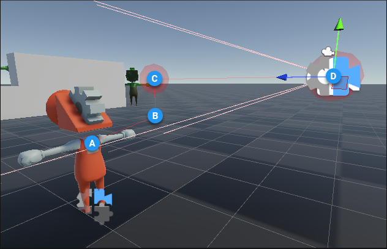
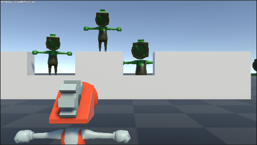
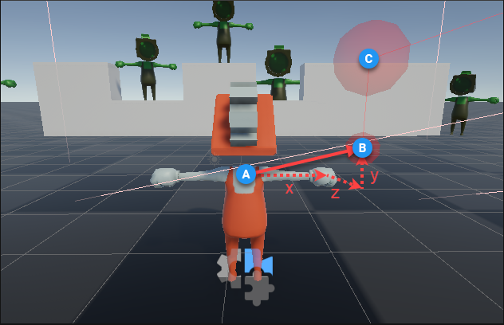
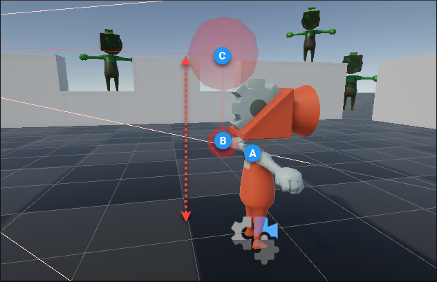

# 第三人称跟随（Third Person Follow）

使用 Cinemachine 相机（CinemachineCamera）的**第三人称跟随**功能，可使相机相对于跟踪目标（Tracking Target）保持固定的位置和距离（受阻尼控制影响），同时跟踪目标的移动和旋转。

第三人称跟随的微型装备（mini-rig）设置，定义了相机相对于目标的位置和距离。通过合适的肩部偏移（shoulder offset），该微型装备可实现第三人称相机效果——角色在画面中偏移，相机从角色肩部上方取景；通过不同的设置，它也能实现第一人称相机效果。

例如，若装备设置如下参数：

| **属性（Property）** | **值（Value）** |
| :------------------- | :-------------- |
| 肩部偏移（Shoulder Offset） | X = 0.7；Y = 0.3；Z = -0.5 |
| 垂直臂长（Vertical Arm Length） | 0.5 |
| 相机侧位（Camera Side） | 1 |
| 相机距离（Camera Distance） | 2 |

会在场景视图（Scene view）中生成如下虚拟装备：

对应的游戏视图（Game view）效果如下：

该装备和相机位置由三个轴心点（原点、肩部、手部）以及一个位于手部后方的相机共同定义：
- **原点（A）**：即跟踪目标的位置。当目标水平旋转时，装备会围绕该点同步旋转。
- **肩部（B）**：默认向一侧偏移，以实现“过肩跟随”位置。跟踪目标的垂直旋转会传递到此处，因此装备会围绕原点水平旋转，并围绕肩部垂直旋转。
- **手部（C）**：相对于肩部的垂直偏移点。臂长会影响相机垂直旋转时跟踪目标在屏幕中的位置。默认情况下，它与肩部保持偏移，确保垂直旋转时角色在屏幕中始终处于合适位置。若用于第一人称相机，可将此值设为 0。
- **相机（D）**：相机的旋转方向始终与跟踪目标的旋转方向平行，但位置位于手部后方，距离由“相机距离（Camera Distance）”参数定义。相机始终直接朝向“手部”轴心点。

请注意装备的旋转规则：
- **B 围绕 A 水平旋转**：以 A 为原点，B 的位置由“肩部偏移（Shoulder Offset）”的 X、Y、Z 值计算得出。 
  
- **C 围绕 B 垂直旋转**：C 的位置由“垂直臂长（Vertical Arm Length）”（相对于 B 的距离）计算得出。正值表示 C 在 B 上方，负值表示 C 在 B 下方。 
  

## 相机控制（Controlling the Camera）
相机没有直接的输入控制方式。你需要通过一个控制器脚本（controller script）来移动和旋转跟踪目标，相机则会根据目标的状态自动调整自身的位置和朝向：
- 当跟踪目标就是角色本身时，相机的旋转方向始终与角色的旋转方向一致。
- 当跟踪目标是一个可独立于角色旋转的不可见游戏对象（invisible GameObject）时，相机便可围绕角色旋转。

## 内置碰撞分辨率（Built-in Collision Resolution）
第三人称跟随组件拥有内置的碰撞分辨率系统：当目标靠近障碍物时，相机会自动调整位置，确保不会进入障碍物内部；借助这一内置功能，即便存在遮挡物，相机也能始终保持目标在视野范围内。当目标与障碍物距离过近时，装备会通过“弯曲”和“拉伸”调整，让相机留在障碍物外部，同时保证目标不脱离视野。

## 抖动移动与稳定瞄准（Shaky Movement, Steady Aim）
将此组件与 [Cinemachine 第三人称瞄准（CinemachineThirdPersonAim）](CinemachineThirdPersonAim.md) 扩展结合使用，可构建一套功能强大的装备，即便相机移动存在抖动或噪声，也能在射击类游戏中实现稳定瞄准。CinemachineThirdPersonAim 会重新调整相机朝向，确保屏幕中心始终保持固定瞄准点，并修正因相机噪声导致的偏差。

## 示例场景（Sample Scene）
若想体验包含相机控制、抖动移动和瞄准模式的第三人称跟随设置，可打开并运行 `ThirdPersonWithAimMode` 示例场景——该场景属于 [Cinemachine 包自带的 3D 示例](samples-tutorials.md)。

## 属性（Properties）：

| **属性（Property）** | **功能（Function）** |
|:---|:---|
| 阻尼（Damping） | 相机跟踪目标的响应速度。三个轴向可分别设置参数，数值代表相机追上目标新位置所需的大致时间（秒）。数值越小，相机响应越灵敏；数值越大，相机响应越缓慢。 |
| 肩部偏移（Shoulder Offset） | 肩部轴心点相对于跟踪目标原点的位置，该偏移基于目标的局部空间。 |
| 垂直臂长（Vertical Arm Length） | 手部轴心点相对于肩部的垂直偏移距离。此参数会影响相机垂直旋转时，跟踪目标在屏幕中的位置。 |
| 相机侧位（Camera Side） | 指定相机位于目标的哪一侧肩部（左侧、右侧，或介于两者之间的位置）。 |
| 相机距离（Camera Distance） | 指定从“手部”轴心点到相机的距离。 |
| 相机碰撞筛选器（Camera Collision Filter） | 指定碰撞分辨率系统会包含或排除哪些图层（Layer）。 |
| 忽略标签（Ignore Tag） | 带有此标签的障碍物会被碰撞分辨率系统忽略，建议将此字段设为目标的标签。 |
| 相机半径（Camera Radius） | 指定相机在不调整位置的情况下，可与可碰撞障碍物保持的最小距离。 |
| 碰撞切入阻尼（Damping Into Collision） | 指定相机为修正遮挡而移动的平缓程度，数值越大，移动越平缓。 |
| 碰撞切出阻尼（Damping From Collision） | 指定相机在通过内置碰撞分辨率系统修正位置后，恢复到正常位置的平缓程度，数值越大，恢复过程越平缓。 |