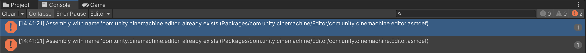
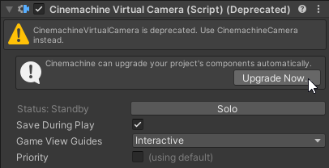
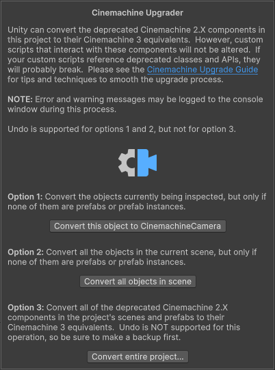

# 从 Cinemachine 2.x 升级项目

如果你的项目当前使用 Cinemachine 2.x，且需要升级到 Cinemachine 3.x，请遵循以下说明操作。

> [!警告]
> Cinemachine 3.x 相对于 Cinemachine 2.x 是一次版本变更，[API 和数据格式已发生重大更改](whats-new.md#major-api-changes)。为 Cinemachine 2.x API 编写的脚本若不经过手动修改，几乎无法在 Cinemachine 3.x 中运行。此外，项目中的虚拟相机（Virtual Camera）实例本身也需要升级。
>
> 在许多情况下，尤其是如果你的项目包含自定义的 Cinemachine 脚本，**继续使用 Cinemachine 2.x 可能是更好的选择**——在 Cinemachine 3.x 发布后的一段时间内，2.x 版本仍将得到支持。如果你确实考虑升级项目，本指南将为你提供一些建议，使升级过程更顺利。

## 前提条件

> [!重要]
> 备份你的项目。不要跳过此步骤。

## 升级包并修复错误

备份项目后，你可以将 Cinemachine 包升级到 3.x 版本。根据项目的复杂度和自定义程度，控制台可能会显示多个错误。

1. 使用包管理器（Package Manager）将项目升级到 Cinemachine 3.x。  
   如果你有使用 Cinemachine API 的自定义脚本，这些脚本很可能会失效，你需要修复它们以重新编译。

2. 更新 `using Cinemachine` 声明。  
   [命名空间已更改](whats-new.md#new-namespaces) 为 `Unity.Cinemachine`。

3. 更新所有对 [已重命名组件](whats-new.md#renamed-components) 的引用。

4. 更新失效的 [Cinemachine 字段名](whats-new.md#renamed-fields)。  
   大多数情况下，只需移除 `m_` 前缀即可。在其他情况下，可能需要更多操作，但通过查看具体代码，应能明确需要采取的措施。

此时，你的项目应该可以使用过时的类大致按之前的方式运行。但不要停留在这一步！继续执行后续步骤。

> [!注意]
> Cinemachine 3.x 升级会显示项目层级（Hierarchy）中隐藏的“cm”游戏对象（GameObject）。这并不意味着可以随意修改这些对象，它们被隐藏是有原因的。建议通过将父对象升级为 Cinemachine 3.x 对应的等效对象来移除它们。如果组件升级后仍有残留的“cm”对象，可以安全地直接删除。

## 升级项目数据并修复警告

一旦脚本使用了新的 API，你就可以升级项目数据，将旧版 Cinemachine 2.x 对象转换为对应的 Cinemachine 3.x 对象。此时，控制台仍可能显示多个关于这些旧版对象的警告。

> [!注意]
> Cinemachine 3.x 以 deprecated（已过时）的形式保留了对已被新版替代的旧版 Cinemachine 2.x 类的支持，以帮助平滑过渡到新 API。
>
> 然而，强烈建议你尽快升级项目以使用新 API。这些已过时的类可能在未来的版本中被移除。为减少交付物中的代码冗余，你可以通过在项目的“脚本定义符号（Scripting Define Symbols）”中添加 `CINEMACHINE_NO_CM2_SUPPORT` 来立即移除对已过时类的支持。

Cinemachine 提供了一个数据升级工具，用于协助转换旧版对象。这并非简单操作，因为除了场景中的虚拟相机对象外，还需要升级可能引用它们的预制体（prefab）和动画资源。

1. 在可能的情况下，将 `CinemachineVirtualCamera` 和 `CinemachineFreeLook` 的引用替换为 `CinemachineVirtualCameraBase` 类，而非派生的 `CinemachineCamera` 类型。  
   这样做的话，Cinemachine 升级工具将能够保留现有的对象引用，因为旧类和新类都继承自同一个基类。

2. 要升级项目数据，请运行 [Cinemachine 升级器](#如何使用-cinemachine-升级器)。  
   根据你的数据升级需求（升级单个对象、单个场景或整个项目），遵循相应的说明操作。

3. 由于 Cinemachine 组件类型已更改，你需要手动检查脚本，并将所有特定引用更新为 [新类型](whats-new.md#new-components-with-clearer-names)。  
   控制台日志会帮助你：“过时（obsolete）”警告会指出需要注意的地方。

4. 数据升级后，对象引用可能会失效。  
   你需要检查并在必要时修复它们。

5. 如果你之前使用图层（layer）将相机过滤到不同的分屏控制器（split-screen brain）中，这种过滤方式已不再生效。  
   要解决此问题，请确保升级到 Cinemachine 相机，并将过滤方式切换为“通道（Channels）”。

> [!注意]
> 如果在任何阶段遇到以下性质的错误，只需重启 Unity 编辑器即可。
> 

### 如何使用 Cinemachine 升级器

你可以从任何 Cinemachine 虚拟相机（Virtual Camera）或自由视角相机（FreeLook）的检视面板（inspector）中启动 Cinemachine 升级器。

> [!注意]
> 如果所有相关的检视面板都在预制体内部，你可以创建一个临时的 Cinemachine 虚拟相机对象，并从其检视面板进行升级。

#### 升级单个对象

如果你只想升级当前正在检视的 Cinemachine 对象（前提是它不是预制体实例），可以执行此操作。此时，升级器只会升级被检视的对象，将其替换为 Cinemachine 3.x 的等效对象。

> [!警告]
> 任何对此对象的脚本引用都将丢失（因为类会发生变化），所有写入该相机内部字段的动画轨道（animation track）也会丢失（因为类和字段名已更改）。引用此对象的时间线（Timeline）将失去绑定。

> [!注意]
> 此操作支持撤销（Undo），因此你可以尝试后再决定是否撤销。

如果存在脚本引用或动画轨道，或者该相机是预制体或预制体实例的一部分，则需要使用 [**升级整个项目**选项](#升级整个项目)，该选项会扫描项目中的引用并进行相应更新。

#### 升级单个场景

你也可以选择更新当前场景中的所有 Cinemachine 对象。但同样，这不会更新场景外的任何资源，因此仅适用于最简单的场景。

> [!注意]
> 此操作也支持撤销（Undo）。

#### 升级整个项目

**升级整个项目**选项会升级所有场景和所有预制体中的对象。该功能包含处理动画轨道、脚本引用和预制体实例的逻辑。这是一项重大操作，项目中的每个场景和预制体都将被多次打开和保存。

> [!警告]
> 此操作不支持撤销（Undo），请确保先进行完整备份。

如果你有需要升级的预制体，或者除了最简单的场景外的其他情况，请选择此选项。