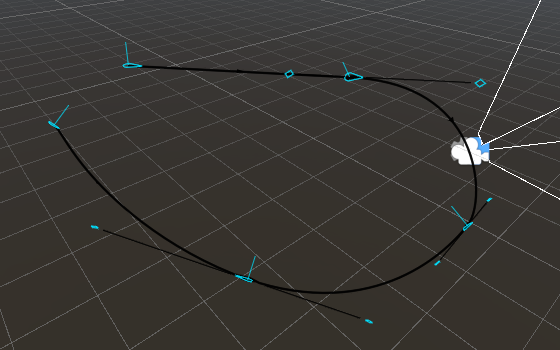

# 将相机约束到路径上

使用 [样条线（Spline）](https://docs.unity3d.com/Packages/com.unity.splines@latest) 可将相机的移动约束在预设且可自定义的路径上。

样条线路径是由场景中的样条线形成的路径。通过样条线可指定固定路线，用于定位 Cinemachine 相机（CinemachineCamera）或为其制作动画。借助 [样条线移动器（Spline Dolly）](CinemachineSplineDolly.md) 行为，能让你的 Cinemachine 相机沿样条线路径移动。

## 创建带有移动路径的 Cinemachine 相机
1. 在 Unity 菜单中，选择 **游戏对象（GameObject）> Cinemachine > 带样条线的移动相机（Dolly Camera with Spline）**。 [层级窗口（Hierarchy）](https://docs.unity3d.com/Manual/Hierarchy.html) 中会出现一个新的 Cinemachine 相机和一条样条线。
2. 在 [层级窗口](https://docs.unity3d.com/Manual/Hierarchy.html) 中，选中新创建的移动样条线游戏对象（dolly spline GameObject）。
3. 在 [检视面板（Inspector）](https://docs.unity3d.com/Manual/UsingTheInspector.html) 或场景视图（Scene View）中，添加并调整路径点（waypoints）。

任意 Unity 样条线都可作为 Cinemachine 中的路径使用：只需将其拖放到 [样条线移动器](CinemachineSplineDolly.md) 的“样条线（Spline）”属性字段中，Cinemachine 相机就会立即被约束到该样条线上。

默认情况下，Unity 样条线不包含旋转数据。相机的旋转角度会由样条线上任意点的切线方向，结合世界上方向向量（world Up vector）推导得出。若要添加围绕切线方向的旋转，可使用 [Cinemachine 样条线侧滚（Cinemachine Spline Roll）](CinemachineSplineRoll.md) 行为——通过该行为，你可以为样条线上的任意点指定侧滚（Roll）值。侧滚值用于控制相机围绕样条线对应点切线方向的旋转，让你能更精准地控制相机的最终旋转角度。

若将 Cinemachine 样条线侧滚行为添加到样条线本身，所有使用该样条线的相机和移动小车（dolly cart）都会应用此侧滚效果；此外，你也可以将该行为直接添加到 Cinemachine 相机上，此时侧滚效果仅对该相机生效。