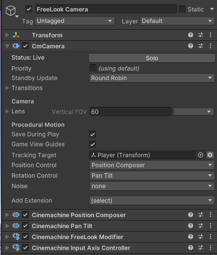

# 创建自由视角相机（Create a FreeLook Camera）

在 Cinemachine 3.0 版本中，自由视角相机（FreeLook Camera）不再像早期版本那样是一个独立的类，而是通过为 [Cinemachine 相机（CinemachineCamera）](CinemachineCamera.md) 配置相应行为来实现。

自由视角相机是一种可跟踪游戏对象（GameObject）目标，并允许用户控制相机视角的 Cinemachine 相机。本质上，它是一种可响应用户输入、围绕目标旋转的相机。实现此类相机有多种方式，每种方式都有其独特的行为风格和特性。选择哪种方式，取决于目标的移动方式以及你期望的特定相机行为。建议仔细思考相机应具备的行为——不存在“一刀切”的通用方案。

当你从“游戏对象（GameObject）”菜单中选择 **Cinemachine > 自由视角相机（FreeLook Camera）** 时，系统默认会创建一个包含以下组件的 Cinemachine 相机：

其中，[轨道跟随（Orbital Follow）](CinemachineOrbitalFollow.md) 组件提供围绕目标旋转的位置功能，[旋转构图器（Rotation Composer）](CinemachineRotationComposer.md) 确保相机无论处于何种位置，始终瞄准目标。用户输入则由 [输入轴控制器（Input Axis Controller）](CinemachineInputAxisController.md) 组件处理——通过该组件的设置，你可以将相机角度映射到任意输入控制方式，并调整其响应灵敏度。

[Cinemachine 自由视角修改器（Cinemachine Free Look Modifier）](CinemachineFreeLookModifier.md) 行为的作用是，允许你根据相机的垂直视角角度调整部分设置。例如，当你从上方或下方观察目标时，可以设置不同的镜头参数。该组件提供了多种可配置的功能选项，当然你也可以自行编写并添加自定义功能。Cinemachine 自由视角修改器是可选组件，若不需要其提供的功能，可将其移除。

此外，还可通过以下方式创建另一种版本的自由视角相机：将“位置控制（Position Control）”行为改为 [位置构图器（Position Composer）](CinemachinePositionComposer.md)，并将“旋转控制（Rotation Control）”行为改为 [摇移俯仰（Pan Tilt）](CinemachinePanTilt.md)，具体配置如下：

在这种配置下，[摇移俯仰（Pan Tilt）](CinemachinePanTilt.md) 组件用于设置视角角度，而 [位置构图器（Position Composer）](CinemachinePositionComposer.md) 组件则负责调整相机位置，确保目标在屏幕上处于合适的显示位置。