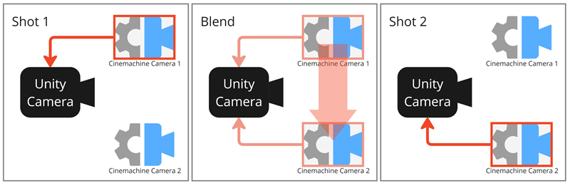
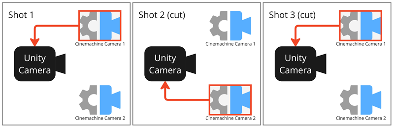

# 相机控制与过渡（Camera Control and Transitions）

了解使 Cinemachine 相机轮流控制 Unity 相机，并通过混合（blend）或切换（cut）实现相互过渡的条件与机制。

## Cinemachine 相机状态（Cinemachine Camera States）
在任意时刻，每个 Cinemachine 相机可能处于三种不同状态之一，但除混合过渡期间外，同一时间仅有一台相机处于**激活（Live）** 状态并控制 Unity 相机。

| 状态（State） | 说明（Description） |
| :--- | :--- |
| **激活（Live）** | Cinemachine 相机主动控制带有 Cinemachine 控制器（Cinemachine Brain）的 Unity 相机。 当从一台 Cinemachine 相机向另一台相机进行[混合过渡](#混合过渡（Blends）)时，两台相机均处于激活状态；混合过渡完成后，仅保留一台激活的 Cinemachine 相机。 |
| **待机（Standby）** | Cinemachine 相机不控制 Unity 相机，但仍会跟随并瞄准其目标，同时保持更新。 处于此状态的 Cinemachine 相机，其游戏对象（GameObject）处于激活状态，且优先级（Priority）等于或低于当前激活的 Cinemachine 相机。 |
| **禁用（Disabled）** | Cinemachine 相机不控制 Unity 相机，也不会主动跟随或瞄准其目标。 处于此状态的 Cinemachine 相机不消耗处理资源。若要禁用 Cinemachine 相机，需停用（deactivate）其游戏对象——此时相机仍存在于场景中，但处于禁用状态。不过，即使游戏对象已停用，若该 Cinemachine 相机正在参与混合过渡，或被时间线（Timeline）调用，仍可控制 Unity 相机。 |

## 激活的 Cinemachine 相机选择（Live Cinemachine Camera Selection）
Cinemachine 相机成为激活相机的条件，取决于你使用 Cinemachine 的场景。默认情况下，Cinemachine 控制器（Cinemachine Brain）负责处理激活相机的选择逻辑。

- 控制器会选择优先级（Priority）最高的活跃[Cinemachine 相机组件](CinemachineCamera.md)，并将其设为激活状态。
- 若多个活跃的 Cinemachine 相机共享相同的最高优先级，则选择其中[最近被激活](https://docs.unity3d.com/Manual/DeactivatingGameObjects.html)的那一台。
- 已停用或优先级较低的 Cinemachine 相机，若处于混合过渡过程中，在过渡完成前仍可保持激活状态。
- 若包含 Cinemachine 轨道的时间线处于活跃状态，时间线会覆盖控制器的优先级系统，直接指定激活相机与混合过渡效果，无论相机的优先级和活跃状态如何。

### 实时动态事件（Realtime Dynamic Events）
通过调整 Cinemachine 相机的优先级，或激活/停用其游戏对象，可实时响应游戏中的动态事件。这在实时 gameplay（游戏玩法）场景中尤为实用——此类场景中的动作往往难以预测。

### 时间线（Timeline）
在镜头顺序可预测的场景（如过场动画）中，可使用[Cinemachine 结合 Timeline](concept-timeline.md) 来编排 Cinemachine 相机并管理镜头。

当 Cinemachine 相机与 Timeline 配合使用时，Timeline 会覆盖 Cinemachine 控制器的优先级系统：即当 Cinemachine 相机片段（Clip）处于活跃状态时，相机的优先级和活跃状态会被忽略。激活相机的选择基于特定 Cinemachine 相机片段的激活状态，从而实现逐帧级别的精准相机控制。

## Cinemachine 相机过渡（Cinemachine Camera Transitions）
每当有新的 Cinemachine 相机成为激活相机时，你可以管理相机之间的过渡效果。

Cinemachine 相机过渡的设置方式，因使用场景不同而有所差异：
* 默认情况下，需在[Cinemachine 控制器组件](CinemachineBrain.md)中设置过渡规则。
* 若使用 Timeline 进行镜头排序，则需在 Timeline 的 Cinemachine 轨道中直接设置过渡。

### 混合过渡（Blends）
通过混合过渡，可将相对简单的镜头组合起来，并根据实时游戏事件或通过时间线编排的方式在镜头间实现混合，从而创建复杂的相机运动效果。

Cinemachine 的混合过渡并非淡入淡出（fade）、擦除（wipe）或溶解（dissolve）效果，而是 Unity 相机从一台 Cinemachine 相机的状态（位置、旋转及其他设置）向另一台的状态进行平滑动画过渡——过程中会确保目标对象始终在视野内，并遵循上方向（Up direction）规则。

  
_**混合过渡（Blend）**：在混合过渡期间，两台 Cinemachine 相机同时控制 Unity 相机，并在预设时间内平滑完成控制权的完全交接。_

### 切换（Cuts）
从定义上来说，切换是镜头间的突然过渡。在 Cinemachine 中，两台相机之间的切换相当于瞬时完成的混合过渡，相机属性不会进行平滑过渡。

  
_**切换示例（Cut example）**：两台 Cinemachine 相机瞬时轮流控制 Unity 相机。_

## 其他资源（Additional Resources）
* [设置多台 Cinemachine 相机与过渡效果](setup-multiple-cameras.md)
* [控制并自定义混合过渡](ControllingAndCustomizingBlends.md)