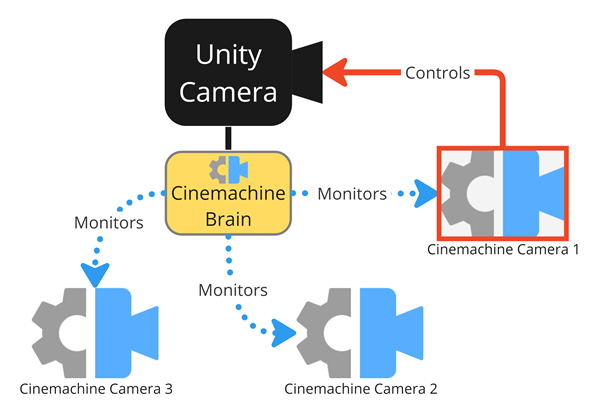
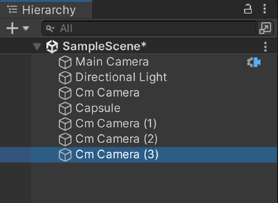

# Cinemachine 核心元素（Cinemachine Essential Elements）

了解构建可正常运行的 Cinemachine 环境所需的核心元素。

## 概述（Overview）
一个可正常运行的 Cinemachine 配置包含三类主要元素：
- 一台 [**Unity 相机（Unity Camera）**](#unity-相机（unity-camera）)：用于捕捉场景中的画面。
- 一个 [**Cinemachine 控制器（Cinemachine Brain）**](#cinemachine-控制器（cinemachine-brain）)：为 Unity 相机启用 Cinemachine 功能。
- 一台或多台 [**Cinemachine 相机（Cinemachine Cameras）**](#cinemachine-相机（cinemachine-cameras）)：根据自身状态轮流控制 Unity 相机。

## Unity 相机（Unity Camera）
Unity 相机是一个包含 [Camera 组件](https://docs.unity3d.com/Manual/class-Camera.html) 的游戏对象（GameObject）。与之不同的是，Cinemachine 相机包含的是用于控制 Unity 相机的其他类型组件。

一个 Cinemachine 配置**必须仅包含一台 Unity 相机**——在 Cinemachine 相机控制它的过程中，这台 Unity 相机是唯一能捕捉场景画面的游戏对象。

## Cinemachine 控制器（Cinemachine Brain）
要配合 Cinemachine 使用，Unity 相机游戏对象必须包含一个 [**Cinemachine 控制器组件（Cinemachine Brain component）**](CinemachineBrain.md)。该组件的主要职责包括：
- 监控场景中所有处于活跃状态的 Cinemachine 相机。
- 确定哪台 Cinemachine 相机控制 Unity 相机。
- 当另一台 Cinemachine 相机接管 Unity 相机控制权时，处理其间的过渡效果。

> [!注意]
> 当你使用 Timeline 编排 Cinemachine 相机镜头的序列时，对于 Cinemachine 相机的优先级和过渡管理，Timeline 会覆盖 Cinemachine 控制器的控制逻辑。

## Cinemachine 相机（Cinemachine Cameras）
Cinemachine 相机（前称“虚拟相机（Virtual Cameras）”）是充当“相机占位符”的游戏对象，可根据自身状态 [接管 Unity 相机的控制权](concept-camera-control-transitions.md)。

当某台 Cinemachine 相机接管 Unity 相机控制权后，会动态覆盖 Unity 相机的属性和行为，具体影响包括：
- Unity 相机在场景中的位置。
- Unity 相机的瞄准目标。
- Unity 相机的镜头设置（视野、裁剪平面等）。
- Unity 相机的后期处理配置文件（若使用）。
- Unity 相机随时间变化的行为方式。

### Cinemachine 相机游戏对象（Cinemachine Camera GameObjects）
Cinemachine 相机游戏对象与 Unity 相机游戏对象相互独立，具有以下特点：
- 它们独立运行，不得相互嵌套。
- 与 Unity 相机游戏对象不同，它们不包含 Camera 组件。
- 它们必须包含一个 [Cinemachine 相机组件（Cinemachine Camera component）](CinemachineCamera.md)。
- 它们可额外添加 Cinemachine 组件，以管理 [程序化运动（procedural motion）](concept-procedural-motion.md) 并扩展功能。

### 单台或多台 Cinemachine 相机（Single or Multiple Cinemachine Cameras）
你可根据项目需求创建任意数量的 Cinemachine 相机；也可根据需求，仅用一台 Cinemachine 相机搭建完整可用的配置。示例如下：
- 若希望 Unity 相机跟随单个角色，可使用一台 Cinemachine 相机，并为其配置符合需求的跟随行为。最终，这台 Cinemachine 相机会成为唯一控制 Unity 相机的设备。
- 若项目需要在多个场景位置呈现多个镜头，应为每个镜头创建一台 Cinemachine 相机（可配置或不配置特定的程序化行为）。这种情况下，你需要了解 Unity 如何处理 Cinemachine 相机的激活与过渡。

### 处理资源消耗（Processing Power Consumption）
Cinemachine 鼓励用户创建多台 Cinemachine 相机，因为其设计初衷就是低资源消耗。若你的场景对性能较为敏感，建议在任意时刻仅激活必要的 Cinemachine 相机，以实现最佳性能。

## 其他资源（Additional Resources）
- [搭建基础 Cinemachine 环境（Set up a basic Cinemachine environment）](setup-cinemachine-environment.md)