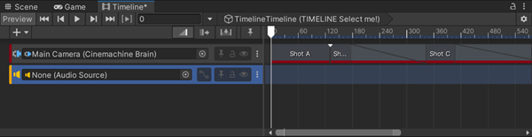
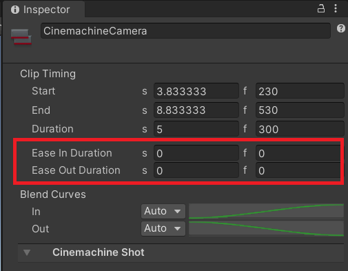

# Cinemachine 与时间线（Timeline）

当你需要制作具有编排相机的可预测镜头序列时，可以使用 [时间线（Timeline）](https://docs.unity3d.com/Packages/com.unity.timeline@latest) 来激活、停用 Cinemachine 相机（CinemachineCamera），并在它们之间进行混合过渡。

**提示**：对于简单的镜头序列，你也可以使用 [Cinemachine 序列相机（Cinemachine Sequencer Camera）](CinemachineSequencerCamera.md) 来替代时间线。

## 激活的 Cinemachine 相机选择（Live Cinemachine Camera Selection）

当时间线驱动 Cinemachine 时，它会覆盖 [Cinemachine 控制器（Cinemachine Brain）](CinemachineBrain.md) 基于优先级做出的决策。当时间线结束时，或者至少在时间线未驱动 Cinemachine 时，控制权会[交还给 Cinemachine 控制器](concept-camera-control-transitions.md)。

## Cinemachine 轨道与镜头片段（Cinemachine Track and Shot Clips）

时间线通过**Cinemachine 轨道（Cinemachine Track）** 中的**Cinemachine 镜头片段（Cinemachine Shot Clips）** 来控制 Cinemachine 相机。每个镜头片段都指向一个需要激活然后停用的 Cinemachine 相机。通过一系列镜头片段，可以指定每个镜头的顺序和持续时间。

## Cinemachine 相机过渡（Cinemachine Camera Transitions）

若要在两台 Cinemachine 相机之间进行切换（cut），将片段相邻放置即可。

若要在两台 Cinemachine 相机之间进行混合（blend），让片段相互重叠即可。

## 多个 Cinemachine 轨道（Multiple Cinemachine Tracks）

同一个时间线中可以包含多个 Cinemachine 轨道。时间线中位置靠下的轨道会覆盖位置靠上的轨道。

当较低轨道上的镜头激活时，若较高轨道上的 Cinemachine 镜头片段仍处于激活状态，你可以用较低轨道的镜头打断较高轨道的镜头。

也可以有多个包含 Cinemachine 轨道的时间线。在这种情况下，最近被激活的时间线会覆盖其他时间线；而在覆盖性时间线中没有激活的 Cinemachine 相机片段的位置，控制权会恢复到之前的时间线。

## 与其他 Cinemachine 轨道及控制器混合（Blend with other Cinemachine Tracks and the Brain）

你可以将一个 Cinemachine 镜头片段与另一个位于单独 Cinemachine 轨道中的片段混合，甚至可以与当前被 Cinemachine 控制器识别为激活状态的 Cinemachine 相机进行混合。

要实现此效果，在检视面板（Inspector）中修改片段的**淡入持续时间（Ease In Duration）** 和**淡出持续时间（Ease Out Duration）** 数值即可。

## 其他资源（Additional Resources）

* [设置时间线与 Cinemachine 相机](setup-timeline.md)