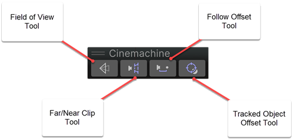
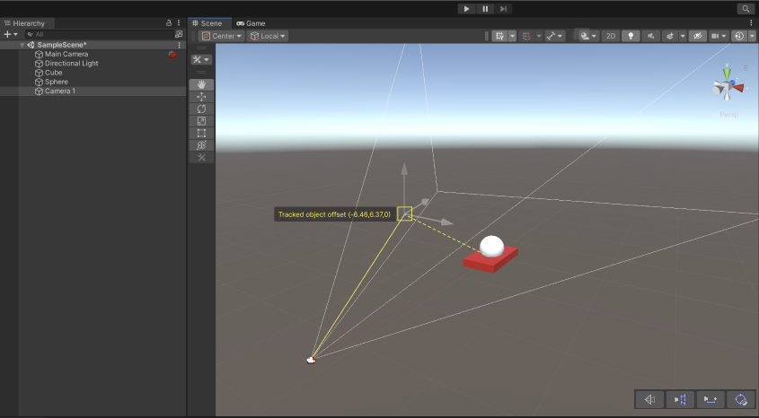

# Cinemachine 操控柄工具栏（Cinemachine Handle Toolbar）

Cinemachine 操控柄工具栏是一组 3D 控制工具，可让你在场景视图（Scene view）中直观地调整 Cinemachine 相机（CinemachineCamera）的参数。你可以使用这些操控柄工具，以交互方式快速高效地调整所选对象的参数，而无需通过检视面板（Inspector）进行控制。

当你选中带有关联操控柄的 Cinemachine 相机类型时，该工具栏会自动显示在场景视图的**工具栏（toolbar）覆盖层**中。

## 操控柄工具（Handle Tools）

工具栏中提供以下四种操控柄工具：

### 1. 视野（FOV，Field of View）
视野工具可根据用户的选择，调整垂直视野（Vertical FOV）、水平视野（Horizontal FOV）、正交大小（Orthographic Size）或焦距（Focal Length）。它能控制的参数如下：
- 当相机处于透视模式（Perspective mode）时，控制垂直或水平视野（具体取决于主相机的选择）。
- 当相机处于正交模式（Orthographic mode）时，控制正交大小。
- 当相机处于物理模式（Physical mode）时，控制焦距。

有关视野（FOV）属性的更多信息，请参阅 [设置 Cinemachine 相机属性](CinemachineCamera.md)。

### 2. 远/近裁剪平面（Far/Near Clip Planes）
- 可拖动控制点来调整远裁剪平面（far clip plane）和近裁剪平面（near clip plane）的距离（拖动时数值会增大）。

有关远裁剪平面和近裁剪平面属性的更多信息，请参阅 [设置 Cinemachine 相机属性](CinemachineCamera.md)。

### 3. 跟随偏移（Follow Offset）
跟随偏移是相对于“跟随目标（Follow Target）”的偏移量。可拖动控制点来增减跟随偏移的位置数值（调整偏移距离）。

有关跟随偏移属性的更多信息，请参阅 [轨道跟随属性](CinemachineFollow.md)。

### 4. 跟踪对象偏移（Tracked Object Offset）
该偏移从相机的当前放置位置开始计算。当所需瞄准区域并非跟踪对象的中心点时，可拖动控制点来增减跟踪目标的位置数值（调整目标偏移）。

有关跟踪对象偏移属性的更多信息，请参阅 [旋转构图器属性](CinemachineRotationComposer.md)。