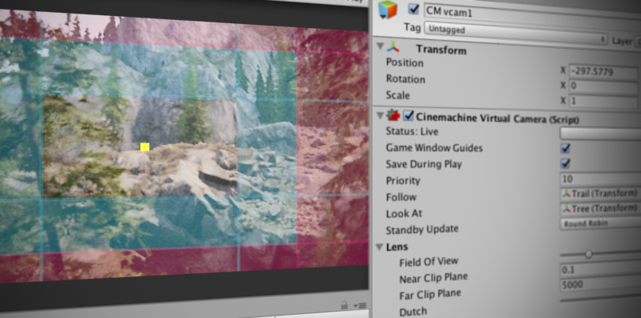

# Cinemachine 包（Cinemachine Package）

>[!注意]
>若要使用 Cinemachine 包，需从 Unity 编辑器中单独安装。有关包的需求条件和安装说明的详细信息，请参阅 [安装（Installation）](InstallationAndUpgrade.md)。

Cinemachine 是一套用于控制 Unity 相机的模块集合。它能解决相机跟踪目标、构图、混合过渡（blending）以及镜头切换（cutting）过程中的复杂数学运算与逻辑处理问题，旨在大幅减少开发过程中耗时的手动操作与脚本修改工作。

这些模块的程序化特性（procedural nature）使 Cinemachine 具备强大的适应性与容错性。当你进行调整（例如修改动画、车辆速度、地形或场景中的其他游戏对象）时，Cinemachine 会动态调整自身行为以呈现最佳镜头效果。例如，无需仅因角色转向从“向右”改为“向左”，就重新编写相机脚本。

Cinemachine 支持实时运行，适用于所有游戏类型，包括第一人称射击（FPS）、第三人称视角、2D 游戏、横向卷轴游戏、俯视角游戏和即时战略（RTS）游戏。它允许你在场景中创建任意数量的镜头，并通过模块化系统组合出复杂的相机行为。

Cinemachine 可与其他 Unity 工具良好协作，是时间线（Timeline）、动画和后期处理资源的强大补充工具。你可以创建自定义[扩展组件（extensions）](concept-procedural-motion.md#extensions)，或将其与自定义相机脚本集成。

### [快速入门（Get started）](get-started.md)

### [示例与教程（Samples and tutorials）](samples-tutorials.md)

### [参考文档（Reference）](Reference.md)