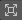

# 以第一人称视角预览和制作 Cinemachine 相机

> [!注意]
> 以下操作需要使用 Unity 的 [相机叠加层（Cameras overlay）](https://docs.unity3d.com/Manual/cameras-overlay.html)。若要使用本文所述的全部功能，需使用 Unity 6.0 或更高版本。

* 浏览所有 Cinemachine 相机，并[快速预览其镜头构图](#预览-cinemachine-相机镜头)，无需从 Cinemachine 控制器（Cinemachine Brain）的角度管理相机激活状态。

* 临时通过 Cinemachine 相机的镜头直接在场景视图（Scene view）中进行导航，以[调整其镜头构图](#制作-cinemachine-相机镜头)。

## 预览 Cinemachine 相机镜头
若要通过 Cinemachine 相机的镜头预览场景，操作步骤如下：

1. 在场景视图中，使用 [叠加层菜单（Overlays menu）](https://docs.unity3d.com/Manual/overlays.html) 显示相机叠加层。

2. 通过下拉菜单选择目标 Cinemachine 相机。

> [!提示]
> * 为每个包含 Cinemachine 相机组件的游戏对象（GameObject）设置独特的名称，便于识别。
> * 若需在预览中查看更多或更少细节，可调整相机叠加层的尺寸。

## 以第一人称视角制作 Cinemachine 相机镜头
若要以第一人称视角制作 Cinemachine 相机镜头，操作步骤如下：

1. 在场景视图中，使用相机叠加层[选择目标 Cinemachine 相机](#预览-cinemachine-相机镜头)。

2. 点击  **以第一人称视角控制所选相机**。

3. 使用 [场景视图导航控件（Scene view navigation controls）](https://docs.unity3d.com/Manual/SceneViewNavigation.html#tools) 移动并旋转视图。
   
   > [!注意]
   > 当通过 Cinemachine 相机在场景中导航时，Unity 会自动调整或限制部分移动操作，以保留与 Cinemachine 相机预期行为相关的约束条件。

4. 在相机叠加层中，点击  **打开相机组件属性**，可编辑相机镜头（Lens）等属性。
   
   打开的窗口允许你编辑 [Cinemachine 相机组件](CinemachineCamera.md) 的所有属性。
   
   > [!注意]
   > 不应在此窗口中编辑**程序化组件（Procedural Components）** 或使用**添加扩展（Add Extensions）** 功能，因为该窗口无法显示这些操作可能产生的额外组件变更。应选中对应的游戏对象，在检视面板（Inspector window）中进行编辑。

5. 当对镜头构图满意后：
   
   * 若已打开相机属性窗口，先将其关闭。
   * 点击  **返回场景相机**。

   > [!警告]
   > 在切换到其他任务并导航场景前，切勿跳过此最后一步，否则刚对 Cinemachine 相机所做的编辑将会丢失。

## 其他资源
* [搭建基础 Cinemachine 环境](setup-cinemachine-environment.md)
* [设置多台 Cinemachine 相机与过渡效果](setup-multiple-cameras.md)