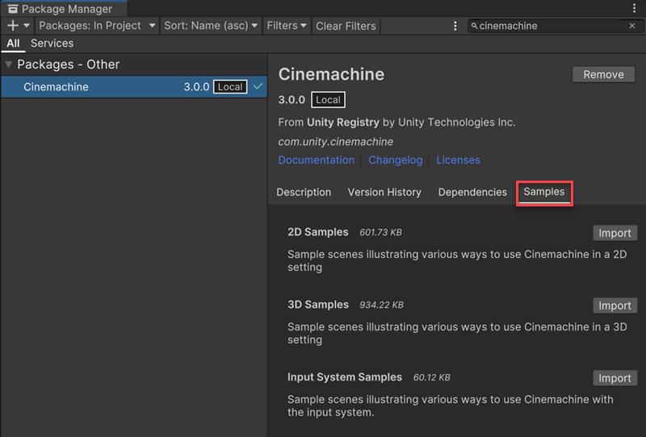

# 向项目中导入示例

若要向项目中导入 **Cinemachine** 示例，请按以下步骤操作：

1. 打开 [包管理器窗口（Package Manager window）](https://docs.unity3d.com/Manual/upm-ui-access.html)。

2. 在可用包列表中找到 **Cinemachine**，并选中它。

3. 在包管理器的右侧面板中，选择 **示例（Samples）** 选项卡。

   

4. 在 [列表](samples-tutorials.md#samples) 中选择一个示例集，然后点击 **导入（Import）**，即可下载并安装对应的示例场景（Scenes）和资源（Assets）。
   
   * 如需了解每个示例集中包含的示例场景的详细信息，请参阅 [示例场景说明（sample scene descriptions）](samples-tutorials.md#sample-scenes)。
   
   * Unity 会将导入的示例放置在项目的资源文件夹（Asset folder）中，路径为 `Assets/Samples/Cinemachine/<版本号>`。

5. 若要探索特定的 Cinemachine 使用场景或配置，可在对应的子文件夹中打开目标场景（Scene），并进入播放模式（Play mode）测试该示例。