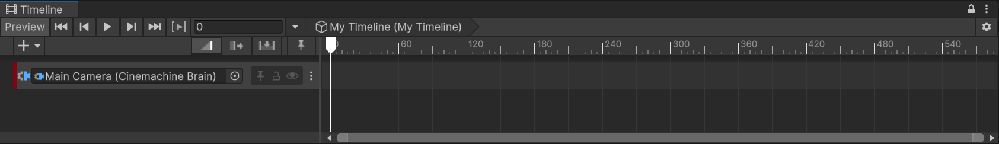
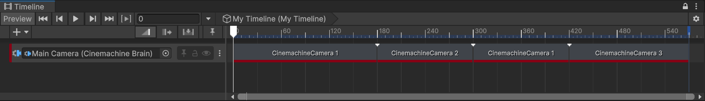
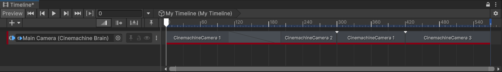

# 配置时间线（Timeline）与 Cinemachine 相机

在 Cinemachine 环境中配置[时间线（Timeline）](concept-timeline.md)，实现 Cinemachine 相机的编排与可预测的镜头序列制作，步骤如下：

* 准备多台 Cinemachine 相机以支持不同镜头需求，
* 准备时间线、创建 Cinemachine 轨道并添加 Cinemachine 镜头片段，
* 管理相机切换（cut）与混合过渡（blend）效果。

## 准备 Cinemachine 相机

1. 在层级窗口（Hierarchy）中，根据你想要的镜头效果，创建若干台[静态](setup-cinemachine-environment.md)或[带程序化行为](setup-procedural-behavior.md)的 Cinemachine 相机，并为每台相机设置不同属性。

2. 为每台 Cinemachine 相机命名，以便后续能轻松识别它们。

## 准备时间线

1. 在场景中创建一个空游戏对象（Empty GameObject）：从编辑器菜单中选择 **游戏对象（GameObject）> 创建空对象（Create Empty）**。

2. 为这个空游戏对象设置一个具有描述性的名称，例如“我的时间线（My Timeline）”。

3. 如果 [时间线（Timeline）窗口](https://docs.unity3d.com/Packages/com.unity.timeline@latest) 尚未打开，请先将其打开，然后为“我的时间线（My Timeline）”游戏对象**创建（Create）** 一个时间线资源（Timeline Asset）和实例。

4. 点击锁定按钮（padlock button）锁定时间线窗口，以便更便捷地添加和调整轨道。

5. 如有需要，添加用于控制场景中主体对象的轨道。例如，添加动画轨道（Animation Track）来为主要角色制作动画。

## 创建带 Cinemachine 镜头片段的 Cinemachine 轨道

1. 从层级窗口中，将包含 Cinemachine 控制器（Cinemachine Brain）组件的 Unity 相机游戏对象拖拽到时间线编辑器中，然后选择 **创建 Cinemachine 轨道（Create Cinemachine Track）**。

   Unity 会在时间线中添加一条以该 Unity 相机为目标的 Cinemachine 轨道。

2. 从层级窗口中，将第一台 Cinemachine 相机游戏对象拖拽到刚添加的 Cinemachine 轨道上。

   Unity 会在该 Cinemachine 轨道中添加一个以你所选 Cinemachine 相机为目标的 Cinemachine 镜头片段（Cinemachine Shot Clip）。

3. 根据需求，对其他 Cinemachine 相机重复执行上一步操作，在 Cinemachine 轨道中添加更多 Cinemachine 镜头片段。

   > [!注意]
   > 同一台 Cinemachine 相机可在 Cinemachine 轨道的不同时间点重复使用，只需在对应位置添加独立的 Cinemachine 镜头片段即可。

4. 根据期望的镜头序列，调整 Cinemachine 镜头片段的顺序和持续时间。

## 创建相机切换效果

若要在两个镜头之间实现相机[切换（cut）](concept-camera-control-transitions.md#cuts)效果：

* 放置两个 Cinemachine 镜头片段，或编辑它们的边界，使两个片段紧密相邻且无重叠。

## 创建相机混合过渡效果

若要使两台 Cinemachine 相机在两个镜头之间实现[属性混合过渡（blend）](concept-camera-control-transitions.md#blends)效果：

* 移动两个 Cinemachine 镜头片段，或编辑它们的边界，使两个片段产生重叠。

   最终的重叠区域将决定混合过渡的持续时间。

