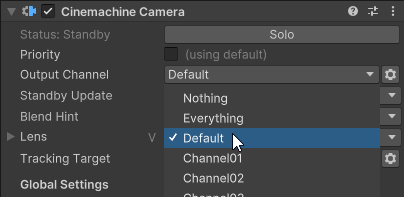
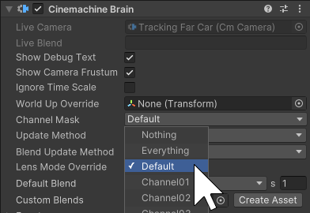
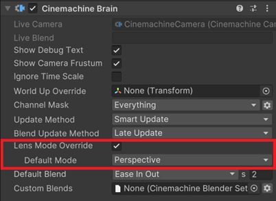

# Cinemachine 3 中的新功能

本页介绍 Cinemachine 3 中的主要新功能和变更。

## 主要 API 变更

Cinemachine 3 的 API 经过了深度调整，以符合 Unity 标准并与引擎的其他部分保持一致。

部分组件已被新组件取代，其他组件已重命名。字段名称已更改，命名空间也已更改。

> [!注意]
> 对于大多数此类问题，如果你从 [Cinemachine 2.x 升级](CinemachineUpgradeFrom2.md)，控制台中会显示错误或弃用警告，这些警告会指向代码中需要注意的部分。

### 新命名空间

命名空间已更改，以更符合 Unity 标准。

| 在 Cinemachine 2.x 中 | 在 Cinemachine 3.x 中 |
| :--- | :--- |
| `Cinemachine` | `Unity.Cinemachine` |
| `Cinemachine.Editor` | `Unity.Cinemachine.Editor` |
| `Cinemachine.Utility` | 合并到 `Unity.Cinemachine` 中 |

### 名称更清晰的新组件

多个组件已被新组件取代。

> [!注意]
> 这些不是简单的重命名，而是全新的组件类型。旧组件仍然存在但已被弃用。如果你的脚本引用了其中任何一个，在数据升级完成后，需要对脚本进行更新。

| 在 Cinemachine 2.x 中 | 在 Cinemachine 3.x 中 |
| :--- | :--- |
| CinemachineVirtualCamera | [CinemachineCamera](CinemachineCamera.md)（见下方注释） |
| CinemachineFreeLook | [CinemachineCamera](CinemachineCamera.md)（见下方注释） |
| CinemachinePath 和 CinemachineSmoothPath | 样条线容器（Spline Container），由 Unity 新的原生样条线实现提供 |
| CinemachineDollyCart | [CinemachineSplineCart](CinemachineSplineCart.md) |
| CinemachineTransposer | [CinemachineFollow](CinemachineFollow.md) |
| CinemachineOrbitalTransposer | [CinemachineOrbitalFollow](CinemachineOrbitalFollow.md) |
| CinemachineFramingTransposer | [CinemachinePositionComposer](CinemachinePositionComposer.md) |
| CinemachineComposer | [CinemachineRotationComposer](CinemachineRotationComposer.md) |
| CinemachinePOV | [CinemachinePanTilt](CinemachinePanTilt.md) |
| CinemachineTrackedDolly | [CinemachineSplineDolly](CinemachineSplineDolly.md) |
| CinemachineGroupComposer | [CinemachineGroupFraming](CinemachineGroupFraming.md) 扩展（与 [CinemachineRotationComposer](CinemachineRotationComposer.md) 配合使用） |
| CinemachineCollider | [CinemachineDeoccluder](CinemachineDeoccluder.md) |
| CinemachineConfiner | [CinemachineConfiner2D](CinemachineConfiner2D.md) 和 [CinemachineConfiner3D](CinemachineConfiner3D.md) |
| Cinemachine3rdPersonFollow | [CinemachineThirdPersonFollow](CinemachineThirdPersonFollow.md) |
| CinemachineSameAsFollowTarget | [CinemachineRotateWithFollowTarget](CinemachineRotateWithFollowTarget.md) |

> [!注意]
> 替代 `CinemachineVirtualCamera` 和 `CinemachineFreeLook` 的新 `CinemachineCamera` 类继承自 `CinemachineVirtualCameraBase`。

### 已重命名的组件

以下组件仅进行了简单重命名。

| 在 Cinemachine 2.x 中 | 在 Cinemachine 3.x 中 |
| :--- | :--- |
| Cinemachine3rdPersonAim | [CinemachineThirdPersonAim](CinemachineThirdPersonAim.md) |
| CinemachineBlendListCamera | [CinemachineSequencerCamera](CinemachineSequencerCamera.md) |

### 已重命名的字段

旧的 `m_FieldName` 命名约定已更改，以遵循 Unity 最新的命名规范。因此，所有字段名称中的 `m_` 前缀已全部移除。

> [!注意]
> 如果你从 [Cinemachine 2.x 升级](CinemachineUpgradeFrom2.md)，且由于此更改导致脚本无法编译，首先要做的是从脚本引用的字段名称中移除 `m_`。大多数情况下，这样就能解决问题。

偶尔，有些字段名称的更改会更明显，但找到相应的替代名称应该相当容易。

`SimpleFollowWithWorldUp` 绑定模式已重命名为 `LazyFollow`。

### 移除了 CinemachineCore.Instance

过去通过 `CinemachineCore.Instance` 单例访问的大多数方法和属性，现在是 `CinemachineCore` 上的直接静态方法和属性。

有一些例外情况，特别是 `ActiveBrainCount` 和 `GetActiveBrain()`，它们现在是 `CinemachineBrain` 中的静态方法。

## 其他架构和集成变更

除了 API 变更外，Cinemachine 3 还包含其他架构和集成变更，以更好地与 Unity 编辑器的其他部分保持一致。

### 更简洁的对象结构，无隐藏游戏对象

Cinemachine 2.x 在虚拟相机的名为“cm”的隐藏子游戏对象上实现 Cinemachine 管线。

这在 Cinemachine 3.x 中已被移除，Cinemachine 管线组件（如 OrbitalFollow 或 RotationComposer）现在直接作为组件实现于 Cinemachine 相机游戏对象上。你可以像访问其他任何组件一样访问它们：不再需要 `GetCinemcachineComponent()`，只需使用 `GetComponent()` 即可。

> [!注意]
> 如果你从 [Cinemachine 2.x 升级](CinemachineUpgradeFrom2.md)，会在层级窗口中看到旧版 Cinemachine 虚拟相机的“cm”子对象，因为 Cinemachine 3.x 会将它们显示出来。升级说明中包含了所有关于如何移除它们的信息。

### 新的输入处理

用户输入已与 Cinemachine 组件解耦：它们不再直接读取用户输入，而是期望由外部组件驱动。

提供了 [CinemachineInputAxisController](CinemachineInputAxisController.md) 来完成此工作，但你也可以选择通过继承 InputAxisControllerBase 来实现自己的输入控制器。

### 新的事件架构

虽然 Cinemachine 2.x 在 CinemachineVirtualCamera 和 CinemachineBrain 中有事件，但 Cinemachine 3.x 仅通过 CinemachineCore 触发全局事件。脚本可以为这些事件添加监听器，并根据事件采取行动。监听器将接收所有相机和所有控制器（Brain）的事件。

现在通过两个新行为支持特定于相机和特定于控制器的事件：[Cinemachine 控制器事件（Cinemachine Brain Events）](CinemachineBrainEvents.md) 和 [Cinemachine 相机事件（Cinemachine Camera Events）](CinemachineCameraEvents.md)。这些行为会监控全局事件，并触发与其所附加对象相关的更专门的事件。

### 新的样条线实现

Cinemachine 的路径现在使用 [Unity 的原生样条线（Splines）](https://docs.unity3d.com/Packages/com.unity.splines@latest) 实现，它们提供了等效功能。

> [!注意]
> 如果你从 [Cinemachine 2.x 升级](CinemachineUpgradeFrom2.md)，Cinemachine 升级器会自动将你的 Cinemachine 路径转换为样条线。Cinemachine 路径实现仍然存在，但现在已被弃用。

### Cinemachine 通道（Channels）替代 Unity 层（Layers）

在 Cinemachine 2.x 中，Cinemachine 控制器（Cinemachine Brain）仅处理分配到相关相机的剔除遮罩（culling mask）所包含层的 Cinemachine 相机。这种机制在分屏等场景中很有用，可以使特定的 Cinemachine 相机分配给特定的控制器。

在 Cinemachine 3.x 中，这已被 **Cinemachine 通道** 取代。这些是仅 Cinemachine 使用的专用层，因此不会不必要地占用 Unity 层。[Cinemachine 相机](CinemachineCamera.md) 被分配到一个 Cinemachine 通道，而 [Cinemachine 控制器](CinemachineBrain.md) 有一个通道遮罩。通常，使用“默认（Default）”通道，仅在需要通道分离的特定场景中才需要更改。

### 镜头模式覆盖（Lens Mode Override）

[Cinemachine 控制器](CinemachineBrain.md) 现在有一个属性，用于控制 Cinemachine 相机是否可以使用镜头模式覆盖（例如在物理相机、透视相机和正交相机之间切换），并指定默认模式。

> [!注意]
> 如果你从 [Cinemachine 2.x 升级](CinemachineUpgradeFrom2.md)，且你的项目使用带有镜头模式覆盖的虚拟相机，那么在你启用镜头模式覆盖并在 Cinemachine 控制器中指定默认镜头模式之前，该功能将无法工作。

## 各种用户体验改进

Cinemachine 3 通过 Cinemachine UI 在设置和自定义方面带来了许多用户体验改进。

### 程序式设置的独立组件

Cinemachine 相机的 [程序式设置](CinemachineCamera.md#set-procedural-components-and-add-extension) 现在以标准 Unity 组件的形式提供，这大大简化了检视面板中 Cinemachine 相机的设置过程。许多设置是可选的，因此在不需要时你不会看到它们。

### 跟踪目标（Tracking Target）简化

现在，Cinemachine 相机默认只有一个 [跟踪目标](CinemachineCamera.md#targets)。当需要注视的目标与需要跟随的目标相同时，这简化了设置。你仍然可以配置一个不同的注视目标（Look At Target），但仅在需要时进行配置。

### 全面改进的自由视角（FreeLook）相机

[自由视角相机](FreeLookCameras.md) 已完全重新设计，由带有标准化程序组件的基础 Cinemachine 相机取代。它功能更丰富，所需设置更少。现在，通过新的 [轨道跟随组件（Orbital Follow component）](CinemachineOrbitalFollow.md)，它还原生支持径向轴缩放。

### 更多自定义机会

* [清晰视角相机（ClearShot cameras）](CinemachineClearShot.md) 现在可以接收自定义 [镜头质量评估器（Shot Quality Evaluator）](CinemachineShotQualityEvaluator.md)。
* [样条线移动器（Spline Dolly）](CinemachineSplineDolly.md) 和 [样条线小车（Spline Cart）](CinemachineSplineCart.md) 现在可以接收自定义自动移动（AutoDolly）实现。
* [自由视角相机（FreeLook cameras）](FreeLookCameras.md) 可以接收用于垂直相机移动的 [自定义修改器（custom modifiers）](CinemachineFreeLookModifier.md)。
* 现在更容易编写自定义 [输入轴控制器（Input Axis Controllers）](CinemachineInputAxisController.md)。

## 示例场景的全面翻新

Cinemachine 3 中的所有 [示例场景](samples-tutorials.md) 都已重新设计，以改善你的学习体验并与新的 Cinemachine 架构保持一致。